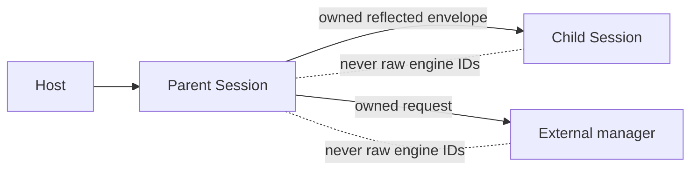

# The TNK Book

*A practical introduction to executable specifications, symbolic reasoning, and hosted rewriting with tambanokano*

**Document status:** explanatory and explicitly nonnormative  
**Book edition:** 2026-08-01  
**Target Reference edition:** 2026-08-01  
**Target workspace version:** `0.1.0`

> **The authority boundary**
>
> This book teaches TNK; it does not define TNK. The normative companion is [The TNK Language and System Reference](manual.md). When an explanation here and a contract clause there appear to disagree, the Reference is authoritative. Stable identifiers such as `TNK-SEARCH-002` name Reference clauses, not rules created by this book.

TNK is an independent rewriting-logic system implemented by the tambanokano Rust workspace. Its source language inherits a substantial intellectual lineage from Maude, but neither Maude behavior nor Maude documentation defines TNK. You do not need to know Maude to read this book.

## What this book is

The Reference answers questions such as “What does this arrow mean?”, “Is this result set complete?”, and “Which Session state survives an error?” This book answers a different set of questions:

- How should equations, rules, search, and strategies fit together in a model?
- What should a result make you believe—and what has not been established?
- How do sorts and algebraic attributes help express the intended state space?
- When should a model author reach for unification, narrowing, SMT, or LTL?
- How does a Rust host own a persistent TNK Session without confusing text rendering with semantics?

The chapters form one conceptual path:

```text
source text
    ↓
module environment
    ↓
canonical data and equational computation
    ↓
rules and transition systems
    ↓
control, search, and symbolic analysis
    ↓
verification
    ↓
host-owned Session and Rust integration
```

The progression is deliberate. A rule system is easier to reason about when its data already has a clear canonical form. Search is easier to interpret when rule transitions are distinct from equational normalization. Verification is meaningful only after the transition system and its finiteness assumptions are explicit. Hosting is safe only after semantic results, Session state, rendering, and terminal policy have been separated.

### The book and the Reference

The two documents divide responsibility as follows:

| The Reference owns | This book owns |
|---|---|
| exact semantics and accepted grammar | mental models and progressive introductions |
| feature states and capability profiles | advice about when to use a feature |
| error and state-transition contracts | debugging workflows and modeling practice |
| completeness and resource boundaries | intuition for interpreting bounded work |
| command and API catalogues | common command and host flows |
| stable versus unspecified ordering | safe ways to consume mathematical result sets |
| minimal normative examples | extended examples, labs, and exercises |

This book sometimes summarizes a contract in a **Contract lens** callout. The associated `TNK-*` identifiers are the durable route to the exact rule. Section numbers are only navigational and may move between Reference editions.

### Feature status

A chapter header names the status and capability profile of its principal surface:

- **Stable** material describes supported behavior governed by stable Reference clauses.
- **Experimental** material is usable but may change incompatibly between releases.
- **Optional** material requires a build feature, backend, or loaded hook library.
- **Unsupported** behavior is discussed only to mark a boundary or provide an alternative.

Feature status and result variability are different. A Stable operation can leave a tie order implementation-defined; an Optional operation has specified behavior when its capability is absent. Consult `TNK-DOC-002`, `TNK-DOC-006`, and the feature matrix in Reference §23 when that distinction matters.

## How to read this book

The book is designed to work cover to cover. Parts I–III are the common spine; later parts develop composition, analysis, hosting, and engineering practice.

- **First-time TNK user:** read Parts I–IV, then Part VII. Return to Parts V and VI when symbolic analysis or embedding becomes relevant.
- **Model author:** read Parts I–IV and Chapters 21–23. These sections cover the stable modeling core and the discipline needed to maintain specifications.
- **Verification user:** read Parts I–V, then Chapters 21–23. Do not skip Chapter 22: a verification result is inseparable from its bound and completeness assumptions.
- **Rust embedder:** read Parts I–III, then Chapters 18–22. The early parts supply the semantic vocabulary required to use `Session` correctly.
- **Advanced language user:** follow the whole sequence. Experimental and Optional chapters clearly mark their boundaries.
- **Reader arriving from Maude:** read Chapters 1–2 to establish TNK terminology, then consult the migration appendix if needed. The main text states TNK behavior directly rather than teaching through differences.

A reader interested only in one advanced facility can jump to it, but each chapter lists prerequisites and links back to the conceptual dependencies it assumes.

## Example conventions

### Reproducible source

Most core examples are self-contained and require no prelude. A complete example can be saved as a `.maude` file and run from the workspace with:

```sh
cargo run --release -p tnk-repl -- -no-banner -no-prelude example.maude
```

The flags use one leading hyphen. `-no-prelude` is intentional: the kernel, frontend, module, and Session libraries never load `prelude.maude` implicitly, and the executable only attempts to load it when that flag is absent. Examples that need a bundled or external library say so and show the required `load` command or capability profile.

A source file may contain modules followed by commands on later physical lines. The executable evaluates the file, prints nonempty results, and then reads further input. With nonterminal standard input at end-of-file, it exits the loop normally.

### Status and profile lines

Every chapter begins with a compact header:

```text
Feature status
Profile or loaded capabilities
Prerequisites
Reference map
```

For example, the SMT chapter distinguishes the Stable null backend from the Optional `smt-z3` backend. The LTL chapter names the loaded model-checker surface. Experimental chapters do not silently present current behavior as a long-term promise.

### Output excerpts

Transcripts emphasize semantic fields: final term and sort, substitutions, reachable state, completion classification, or backend answer. Incidental wrapping, elapsed time, aggregate rewrite totals, same-depth solution order, fresh-variable spelling, and diagnostic prose may be omitted. An ellipsis in a transcript means “human-oriented output omitted,” not an extra TNK token.

When a command returns several mathematical solutions, examples discuss them as canonical sets unless the Reference promises an order. When an intentionally invalid example is shown, the important facts are its diagnostic category and state effect—not a sentence fragment that may change.

### The recurring examples

The book uses three levels of examples:

1. **Microexamples** isolate one concept in a few lines.
2. **A key-sharing protocol** provides the main system-modeling spine: canonical configurations, rules, search, strategies, a reachable bug, repair, and temporal verification.
3. **Specialist labs** cover topics that would be artificial additions to the protocol, such as algebraic unification, variants, SMT arithmetic, and reflection.

A typed expression evaluator and a generic stack provide a second thread for equational modeling and parameterization. The examples are deliberately small enough to inspect, yet complete enough to run.

### A standard chapter rhythm

Most chapters proceed through:

1. a concrete question;
2. a model or command that answers it;
3. the mental model behind the result;
4. a Contract lens identifying guarantees and non-guarantees;
5. common mistakes;
6. exercises and direct Reference links.

The book does not repeat the complete command grammar, hook catalogue, feature matrix, or API inventory. Those belong to the Reference appendices.

## Contents

- **Part I — A working mental model**
  - Chapter 1 — Rewriting as a way to describe computation
  - Chapter 2 — Your first TNK session
  - Lab A — A complete tiny model
- **Part II — Data and equational computation**
  - Chapter 3 — Signatures, terms, and syntax
  - Chapter 4 — Equations compute canonical values
  - Chapter 5 — Subsorts, memberships, and partial operations
  - Chapter 6 — Conditions and backtracking
  - Chapter 7 — Computing modulo algebraic laws
  - Lab B — A typed expression language
- **Part III — Systems, search, and control**
  - Chapter 8 — Rules describe change
  - Chapter 9 — Rewriting modes and continuations
  - Chapter 10 — Search is graph exploration
  - Chapter 11 — Strategies as programmable control
  - Lab C — Find and repair a protocol bug
- **Part IV — Composing larger models**
  - Chapter 12 — Modules, imports, and renaming
  - Chapter 13 — Theories, views, and parameters
  - Lab D — A reusable generic component
- **Part V — Symbolic reasoning and verification**
  - Chapter 14 — From matching to unification
  - Chapter 15 — Variants and narrowing
  - Chapter 16 — SMT constraints
  - Chapter 17 — Invariants and temporal properties
  - Lab E — A complete verification argument
- **Part VI — Hosting and extending TNK**
  - Chapter 18 — A Session is a state machine
  - Chapter 19 — Embedding TNK in Rust
  - Chapter 20 — Reflection, objects, and external systems
- **Part VII — Engineering reliable TNK systems**
  - Chapter 21 — Diagnostics, tracing, and debugging
  - Chapter 22 — Termination, completeness, and resources
  - Chapter 23 — Testing and evolving models
  - Lab F — A hosted analysis tool
- **Appendices**
  - Appendix A — Choosing and adapting examples
  - Appendix B — Reading conventions
  - Appendix C — Navigating the Reference
  - Appendix D — Command and capability quick guide
  - Appendix E — Maude lineage and migration
  - Appendix F — Completion checklists


---

# Part I — A working mental model

The first goal is not encyclopedic knowledge. It is a complete, executable model and a reliable vocabulary for what TNK did.

## Chapter 1 — Rewriting as a way to describe computation

**Feature status:** Stable core semantics  
**Profile:** default; no prelude required  
**Prerequisites:** none  
**Reference map:** `TNK-TERM-*`, `TNK-REDUCE-*`, `TNK-RULE-001`, `TNK-SEM-001`, `TNK-SEARCH-*`

A conventional program usually begins with a sequence of instructions. A rewriting-logic model begins with descriptions of data and change:

- **terms** represent values or states;
- **equations** identify how data is computed into canonical form;
- **rules** describe possible transitions between canonical states;
- **search** explores the graph induced by those transitions;
- **strategies** select and combine transitions without redefining them;
- **verification** asks properties of paths through that graph.

These roles overlap operationally—equations are evaluated while rule commands run—but they are not interchangeable.

### Terms are structured data

Consider the term:

```text
twice(s(s(z)))
```

It is not initially a machine integer. It is an application of the operator `twice` to a term built by two applications of `s` to `z`. Its meaning comes from the signature and equations in its module.

A term's tree presentation is semantic; the runtime may share repeated subterms in a DAG, but sharing does not change the represented value. Operator attributes such as associativity or commutativity can identify multiple tree presentations as the same structural term. User equations then compute over that axiom-canonical representation.

### Equations choose canonical representatives

The equations

```maude
eq twice(z) = z .
eq twice(s(N)) = s(s(twice(N))) .
```

turn `twice(s(s(z)))` into `s(s(s(s(z))))`. They do not describe an event in a system. They say how a value is normalized.

This distinction matters later. Search nodes are equation-normal states. If two rule paths produce terms that normalize to the same canonical state, the search graph interns one state rather than treating the surface spellings as distinct histories.

### Rules describe possible change

A rule such as

```maude
rl [switch-on] : off(N) => on(N) .
```

states that an `off` state may transition to an `on` state. Unlike an equation, the transition is not a claim that `off(N)` and `on(N)` are two representations of the same value. The direction and occurrence of the transition matter.

Multiple rules can apply to one state. That is useful: nondeterminism represents scheduling, environmental choices, protocol alternatives, or abstraction. A single `rewrite` run chooses a driven path; `search` explores alternatives.

### Search answers a graph question

Suppose switching off also increments a counter:

```maude
rl [switch-off] : on(N) => off(s(N)) .
```

Starting from `off(z)`, the rule graph begins:

```text
off(z) --switch-on--> on(z) --switch-off--> off(s(z)) --switch-on--> ...
```

The query

```maude
search [1] off(z) =>+ off(s(z)) .
```

asks for at most one state reachable by one or more rule transitions that matches the target. The target is reached at rule depth two. Equation reductions performed while constructing canonical states do not add rule depth.

The bound `[1]` limits reported solutions. It does not prove that only one solution exists, and it does not turn an infinite graph into a finite one.

> **Contract lens — three relations**
>
> `TNK-SEM-001` distinguishes axiom equality, equational reduction, and rule transition. `TNK-SEARCH-001` constructs a graph of equation-normal states connected by rule transitions. Treating an equation as a transition, or a rule as mere normalization, changes the model.

### One complete module

The ideas fit in one executable source:

```maude
mod SWITCH is
  sorts Nat State .
  op z : -> Nat [ctor] .
  op s_ : Nat -> Nat [ctor] .
  op twice : Nat -> Nat .
  ops off on : Nat -> State [ctor] .

  var N : Nat .
  eq twice(z) = z .
  eq twice(s(N)) = s(s(twice(N))) .

  rl [switch-on] : off(N) => on(N) .
  rl [switch-off] : on(N) => off(s(N)) .
endm

reduce in SWITCH : twice(s(s(z))) .
rewrite [1] in SWITCH : off(z) .
search [1] in SWITCH : off(z) =>+ off(s(z)) .
```

The three semantic observations are:

```text
result Nat: s s s s z
result State: on(z)
Solution ... at rule depth 2, with an empty substitution
```

The exact rewrite totals and search state number are not the point. The first result is an equation-normal value. The second is one bounded rule step. The third is a reachability witness in the BFS graph.

### Strategies and verification come later

A strategy can say “apply `switch-on`, then `switch-off`” or repeatedly choose among labels. It controls the rule relation but does not make the controlled path equal to all reachable paths.

A temporal property can ask whether every infinite path eventually returns to `off`, or whether `on` recurs forever. Such claims require more than one successful rewrite. They depend on the graph, deadlock treatment, and finiteness or termination assumptions. Chapters 10, 11, and 17 develop those distinctions.

### Common mistakes

- Putting an event in an equation collapses before-and-after states into one canonical value.
- Putting deterministic data simplification in rules unnecessarily expands the state graph.
- Reading one `rewrite` result as proof about all paths confuses execution with exploration.
- Reading a bounded search with no reported solution as a proof of unreachability confuses a prefix with exhaustion.
- Treating rewrite totals as the meaning of a computation overconstrains implementation details.

### Exercises

1. Add a rule `reset : on(N) => off(z)` and draw the first four BFS layers by hand.
2. Predict the result of `reduce twice(s(s(s(z))))` before running it.
3. Explain why `rewrite` without a bound does not terminate for `SWITCH`.
4. Replace `switch-off` with an equation. Describe how the semantic interpretation changes, not merely the output.

## Chapter 2 — Your first TNK session

**Feature status:** Stable Session semantics; Experimental CLI and text-record surfaces where classified  
**Profile:** default or prelude-free executable  
**Prerequisites:** Chapter 1  
**Reference map:** `TNK-DOC-004`, `TNK-SESSION-*`, `TNK-LOAD-*`, `TNK-OUT-*`, `TNK-CLI-001`

TNK has several public layers. The executable is a terminal adapter around a reusable `Session`; the Session in turn owns modules, commands, and continuations built on the lower crates. Keeping those layers distinct prevents output formatting from becoming an accidental language feature.

### Run a source file

Save the `SWITCH` module from Chapter 1 as `switch.maude`, with or without the commands beneath it. From the workspace root:

```sh
cargo run --release -p tnk-repl -- -no-banner -no-prelude switch.maude
```

The executable reads the positional file exactly as written. `-no-banner` suppresses its greeting. `-no-prelude` prevents the executable from searching for `prelude.maude`. Neither option changes the semantics of the definitions in a self-contained file.

Without `-no-prelude`, the executable searches the directories in `MAUDE_LIB` and then the current directory for `prelude.maude`. Failure to find one emits a warning and continues. A bare `Session` never performs this search.

### Enter complete submissions

At a terminal, TNK buffers input until `input_complete` recognizes a complete top-level submission. A module can span many lines:

```maude
fmod COLORS is
  sort Color .
  ops red green blue : -> Color [ctor] .
endfm
```

Entering the definition successfully makes `COLORS` current. A subsequent command can omit `in COLORS :`:

```maude
reduce red .
```

An explicit module qualifier applies only to that command:

```maude
reduce in COLORS : blue .
```

It does not change the current selection. `select COLORS .` does change it and always clears any saved continuation.

A Session submission may contain several complete top-level items on separate physical lines. Two commands placed on one physical line are not two submissions; they form one invalid command input. Source files should put top-level commands on separate lines even when their terms are short.

### Inspect persistent state

Useful inspection commands include:

```text
show modules .
show module COLORS .
show views .
select COLORS .
```

Search and narrowing operations add graph-specific inspection commands later:

```text
show search graph .
show path N .
show frontier states .
show most general states .
```

A Session persists:

- parsed and built modules and views;
- its current module;
- settings;
- loaded-file records;
- reflection and local-interpreter state;
- at most one continuation.

Defining a second module does not discard the first. Independent `Session` values, however, share no semantic state.

### Read output in layers

A typical reduction record contains:

```text
reduce in SWITCH : twice(s s z) .
rewrites: 3
result Nat: s s s s z
```

Interpret it as three layers:

1. **command presentation:** the command TNK understood;
2. **diagnostic accounting:** work recorded by this implementation;
3. **semantic result:** final least sort and term.

The semantic claim is the normal form `s s s s z` at sort `Nat`. The total `3` is useful while inspecting work, but exact aggregate totals are not generally a mathematical contract. Terminal wrapping may also add line breaks that are absent from `Session::eval` output.

A search record adds a graph state number, discovered-state count, and substitution. A match or unification record may contain several numbered substitutions. Failure records distinguish phrases such as `No match.`, `No unifier.`, and `No more solutions.`, but the current `Eval` value is still only text plus an exit flag. It is not a typed semantic event stream.

> **Contract lens — text is not control flow**
>
> Under `TNK-OUT-003`, severity prefixes and documented state effects are the stable parts of diagnostics; full prose is human-oriented. A production host should not branch by searching for an arbitrary sentence in `Eval.output`. Use a typed lower-layer result when the text boundary does not expose the distinction you need.

### Load versus positional files

Within a Session:

```text
load library
sload library
```

are line-terminated and need no period. They try the written path and then a `.maude` suffix, first relative to the process working directory and then under `MAUDE_LIB`. `sload` skips a file after its canonical path has already been loaded by that Session; `load` evaluates it again.

This differs from the CLI positional file, which is read exactly as written and does not receive suffix completion or library-path search.

### Exit belongs to the host

At the command surface, `quit`, `q`, and `exit` produce `Bye.` and set `Eval.exit = true`. `Session` itself does not terminate a process. The terminal executable sees the flag and leaves its loop; a GUI, service, or notebook host can interpret it according to its own lifecycle.

### Common mistakes

- Assuming every library layer implicitly has `NAT`, `BOOL`, or another prelude module available.
- Treating `in M :` as a persistent module selection.
- Running a second semantic command before `continue` and expecting the old continuation to remain portable.
- Parsing wrapped terminal output when unwrapped Session text—or a lower typed API—is the actual integration boundary.
- Assuming a source-level diagnostic in a readable positional file forces a nonzero process status; current CLI evaluation diagnostics remain Session output.

### Exercises

1. Enter two modules, use `show modules .`, and switch between them with `select`.
2. Run `SWITCH` from a positional file with and without its commands. Observe when the current module becomes available interactively.
3. Put two commands on one physical line, then on separate lines. Classify the difference without relying on exact prose.
4. Set `MAUDE_LIB` to a directory containing a small source file and compare `load name` with a CLI positional filename.

## Lab A — A complete tiny model

**Feature status:** Stable modeling core  
**Profile:** default; no prelude required  
**Prerequisites:** Chapters 1–2  
**Reference map:** `TNK-SORT-*`, `TNK-REDUCE-*`, `TNK-RULE-001`, `TNK-SEARCH-*`

This lab rebuilds the first example from an empty file and then asks questions that distinguish normalization, execution, and exploration.

### Step 1: declare the data

Create `switch.maude`:

```maude
mod SWITCH is
  sorts Nat State .

  op z : -> Nat [ctor] .
  op s_ : Nat -> Nat [ctor] .
  op twice : Nat -> Nat .

  ops off on : Nat -> State [ctor] .
```

`z`, `s_`, `off`, and `on` are constructors: they build data. `twice` is a defined operator whose equations come next. The underscore in `s_` is a mixfix hole, so `s z` is the ordinary surface form; `s(z)` is also accepted for this true prefix operator.

### Step 2: define canonical computation

Add:

```maude
  var N : Nat .

  eq twice(z) = z .
  eq twice(s(N)) = s(s(twice(N))) .
```

The second equation makes structural progress by removing one outer `s` from the argument of `twice`. Recursive calls therefore reach `twice(z)` for every finite constructor numeral.

### Step 3: define state transitions

Add:

```maude
  rl [switch-on] : off(N) => on(N) .
  rl [switch-off] : on(N) => off(s(N)) .
endm
```

The labels will later be usable from strategies and traces. The counter increments only on the `switch-off` transition.

### Step 4: ask three different questions

Append these commands on separate lines:

```maude
reduce in SWITCH : twice(s(s(z))) .
rewrite [1] in SWITCH : off(z) .
search [1] in SWITCH : off(z) =>+ off(s(z)) .
```

Run the file prelude-free. Check the semantic observations:

- reduction produces four successors of `z` at sort `Nat`;
- one bounded rule application produces `on(z)`;
- the target `off(s(z))` is reachable at rule depth two.

Do not assert the exact aggregate rewrite totals or graph state number.

### Step 5: reason before running

For each query below, write down the expected semantic outcome first:

```maude
reduce in SWITCH : twice(z) .
rewrite [3] in SWITCH : off(z) .
search [1,1] in SWITCH : off(z) =>+ off(s(z)) .
search [1,2] in SWITCH : off(z) =>+ off(s(z)) .
```

The depth-one search does not find the target; that is a bounded-prefix result, not proof of unreachability. The depth-two query can find it. The three-step rewrite follows one driven path and reaches `on(s(z))`.

### Step 6: extend the model

Insert a reset transition immediately before the module's `endm`:

```maude
rl [reset] : on(N) => off(z) .
```

Now draw the graph through depth three. There are alternative successors from `on(N)`. Compare:

- the one path selected by `rewrite [3]`;
- all canonical states discovered by `search`;
- the effect of repeated visits to `off(z)` being deduplicated in the search graph.

### What you should now understand

You can now:

- declare constructors and defined operators;
- normalize a value with equations;
- describe state change with rules;
- place a finite bound on one rewrite run;
- ask a bounded reachability question;
- distinguish a reported result from exhaustion of the entire state space.

The next part builds a richer account of terms, sorts, equations, conditions, and algebraic structure.

---

# Part II — Data and equational computation

The quality of a transition system depends on the quality of its data model. This part develops the source language needed to give every state a clear sort, every operator a clear role, and every value a useful canonical form.

## Chapter 3 — Signatures, terms, and syntax

**Feature status:** Stable, except implementation-defined first-packed-parse choices named by `TNK-PARSE-002`  
**Profile:** default; literal families require their loaded hooks  
**Prerequisites:** Part I  
**Reference map:** `TNK-SORT-*`, `TNK-LEX-*`, `TNK-PARSE-*`, `TNK-MOD-001`

A module signature answers three questions before any equation or rule runs:

1. Which sorts of values exist?
2. Which operators build or consume them?
3. Which surface phrases denote well-sorted terms?

TNK uses the signature to construct a grammar for each module. Parsing and sort analysis are consequently connected: an operator declaration is both a semantic declaration and, when mixfix notation is used, a grammar production.

### Sorts organize values

A declaration

```maude
sort Nat .
```

introduces one user sort. Several can be declared together:

```maude
sorts Zero NzNat Nat Exp .
subsorts Zero NzNat < Nat < Exp .
```

The subsort relation says that every `Zero` and every `NzNat` is a `Nat`, and every `Nat` is an `Exp`. TNK closes this relation reflexively and transitively. Cycles between distinct user sorts invalidate the signature.

Connected sorts form a **kind**. TNK synthesizes one error/top sort per kind. If `Nat` is the maximal user sort in its component, the kind is printed as `[Nat]`; a component with incomparable maxima can print a name such as `[Nat,Bool]`.

A kind is not a dynamic “any” type. It is the boundary at which a term can remain representable even when no user-sort overload applies. Partial operators make deliberate use of this behavior. Ordinary successful values should normally have user sorts.

### Operators define term shapes

The declaration

```maude
op z : -> Zero [ctor] .
```

defines a constant: arity zero, no domain sorts, range `Zero`.

```maude
op s_ : Nat -> NzNat [ctor] .
```

defines a unary operator. The underscore is a hole, so its natural surface form is:

```text
s z
s s z
```

For a true prefix operator declared without a hole,

```maude
op pred : Nat ~> Nat .
```

the application is written `pred(s z)`. Constants and true prefix operators gain ordinary prefix productions; a hole-bearing mixfix operator does not gain a second synthetic spelling such as `_+_(a,b)`.

The number of holes in a valid mixfix name equals its arity:

```maude
op _+_ : Nat Nat -> Nat .
op if_then_else_fi : Bool Exp Exp -> Exp .
```

The first declaration has two holes. The second has three. Literal fragments such as `if`, `then`, `else`, and `fi` become tokens in the generated grammar.

### Overloading is sort-directed

The same written operator can have several declarations:

```maude
op _+_ : Nat Nat -> Nat .
op _+_ : Exp Exp -> Exp .
```

For arguments whose least sorts are both `Nat`, both declarations are applicable, but `Nat` is the more specific result. For general `Exp` arguments only the second declaration applies.

Applicability is pointwise: an argument of sort `A` fits a declared domain `S` when `A <= S`. A well-behaved overload family has a unique least result for every applicable argument profile. If incomparable applicable ranges have no unique least choice, TNK classifies the application as non-preregular and currently chooses the earliest declared range for that fixed declaration order. Portable model design avoids relying on that fallback.

Declarations with incompatible arity or kind profiles are separate semantic symbols even when they share a source spelling. This prevents a unary `f` in one kind from being silently confused with a binary `f` in another.

> **Contract lens — least sort**
>
> Under `TNK-SORT-003`, overload selection follows the argument least sorts. A substitution must also respect declared variable sorts under `TNK-SORT-006`. Sorts therefore constrain both term construction and solution generation.

### Variables have source scope and sort

Inside a module:

```maude
vars M N : Nat .
var E : Exp .
```

declare bare variables for statements in that source scope. In a command, a colon occurrence can introduce a variable:

```maude
match X:Exp <=? s(z) .
```

The name alone is not a global semantic identity. Internal slots and generated fresh-variable families can differ between independent commands. What matters is the written variable, its scope, and its sort in the operation being solved.

Repeated occurrences are nonlinear constraints. In:

```text
pair(X, X)
```

both occurrences receive semantically equal values at the matching or unification boundary.

### Precedence and gather resolve structure

Parentheses are the simplest disambiguation tool. TNK also supports:

- `prec n` for operator precedence;
- `gather (...)` for how tightly each hole may capture;
- `(term).Sort` for explicit overload-result disambiguation.

You rarely need to calculate a whole grammar by hand. Use conventional precedence, parenthesize whenever a reader could hesitate, and add a sort qualification when overload resolution is the actual subject of the example.

Some command bubbles currently choose the first packed-forest parse. That order is implementation-defined. Other bubbles—such as statement terms, match patterns, and search goals—require uniqueness. Source intended to survive releases should be unambiguous rather than depending on which parse happened to be first.

### Tokens are not conventional identifiers

Whitespace and `()[]{},` split tokens. Many other characters can be part of operator names, including `_`, `+`, `-`, `<`, `=`, `:`, and ordinary periods. A backquote escapes a splitting character into the current identifier.

Spacing can change the token class:

```text
1/6     exact rational token, when its hooks are loaded
1 / 6   three tokens forming an operator application
-7      negative-integer token
- 7     operator token followed by a natural token
```

The lexer can recognize literal-shaped tokens, but the frontend can construct their semantic terms only when the loaded signature provides the corresponding hooks. A prelude-free module with no numeric hooks should use declared constructors such as `z` and `s_`, not assume that decimal `42` has an available sort.

Periods deserve particular care because `.` may also be part of an operator. Portable source puts a declaration or command terminator at the end of its physical line. Line comments begin with `***` or `---`; their balanced parenthesized forms can span lines.

### Module forms establish gates

The core forms used in this book are:

```text
fmod ... endfm    functional module: equations and memberships
mod  ... endm     system module: additionally rules
smod ... endsm    strategy system module
fth  ... endfth   functional theory
th   ... endth    system theory
```

Object and strategy theories appear later. A functional module rejects rules; strategy declarations belong in strategy modules; object declarations belong in object modules. These are semantic gates, not merely choices of closing keyword.

### Common mistakes

- Declaring a binary mixfix operator with one or three holes.
- Assuming a literal token automatically has a semantic sort without its hooks.
- Treating a kind error sort as an ordinary success type.
- Depending on an ambiguous packed-forest choice.
- Reusing a source spelling with incompatible kind profiles and assuming it is one overload family.
- Writing two top-level commands on one physical line because both contain terminating periods.

### Exercises

1. Declare prefix, postfix, infix, and outfix constructors for a small expression language.
2. Create a `Zero < Nat < Exp` hierarchy and predict the least sort of each constructor term.
3. Define two `_+_` overloads over `Nat` and `Exp`; use `(term).Sort` to make an intended result explicit.
4. Compare the token streams suggested by `-3`, `- 3`, `1/2`, and `1 / 2`.

## Chapter 4 — Equations compute canonical values

**Feature status:** Stable  
**Profile:** default; built-in equations require their loaded hooks  
**Prerequisites:** Chapter 3  
**Reference map:** `TNK-TERM-001`, `TNK-REDUCE-*`, `TNK-CMD-REDUCE-001`, `TNK-COUNT-*`

An equation is executable orientation, not merely symmetric mathematical notation. Given:

```maude
eq lhs = rhs .
```

TNK matches `lhs` against a redex, instantiates `rhs`, and continues reducing according to the owning operator strategy. Good executable equations orient many surface terms toward a small, stable collection of normal forms.

### A Peano addition example

```maude
fmod PEANO-ADD is
  sort Nat .
  op z : -> Nat [ctor] .
  op s_ : Nat -> Nat [ctor] .
  op _+_ : Nat Nat -> Nat .

  vars M N : Nat .
  eq z + N = N .
  eq (s M) + N = s(M + N) .
endfm
```

Reduction of:

```maude
reduce in PEANO-ADD : (s(s(z))) + s(z) .
```

proceeds conceptually as:

```text
s(s(z)) + s(z)
→ s(s(z) + s(z))
→ s(s(z + s(z)))
→ s(s(s(z)))
```

The result is a normal form at sort `Nat`. Parentheses and pretty-printer spacing may differ, but the represented constructor term is fixed.

### A normal form is relative to a module

“Normal form” means that no executable equation or successful special hook applies under the module's evaluation strategy. It does not mean:

- the smallest possible textual term;
- a proof that the equation set is confluent;
- a value independent of declaration priority when equations overlap;
- a rule normal form.

Model authors remain responsible for termination and, when unique values matter, confluence modulo the declared axioms. TNK can deterministically choose an equation without proving that another orientation would not yield a different normal form.

### Choice at one redex

At a top redex, TNK tries:

1. an implemented special hook, if the symbol has one;
2. ordinary executable equations in flattened declaration order;
3. `[owise]` equations only after all ordinary matches and condition solutions fail.

The first equation substitution whose condition succeeds is used. This makes declaration order observable where equations overlap.

An `[owise]` equation is useful for a genuine fallback:

```maude
op classify : Nat -> Class .
eq classify(z) = zero-class .
eq classify(N) = other-class [owise] .
```

It is not a substitute for understanding overlapping rules. If a later specific ordinary equation should take priority, declare and test the intended order explicitly.

### Constructors and defined operators

`[ctor]` records constructor metadata used by symbolic analyses. It does not itself block an equation or perform a rewrite. As a modeling convention:

- constructors describe canonical data shapes;
- defined operators are eliminated or simplified by equations.

This convention makes it easier to see whether a normal form still contains an unintentionally stuck computation.

### Evaluation strategy

Without an explicit `strat (...)` attribute, TNK uses its standard eager strategy. A strategy list can name 1-based argument positions and `0` for a top-rewrite attempt. This controls when arguments and the top are considered.

Do not introduce a custom strategy merely to change an incidental rewrite count. Use it when evaluation order is part of the operator's intended observable behavior—for example, when a lazy branch must not evaluate an unselected divergent argument.

`frozen` has a different primary role: it blocks rule-rewrite or narrowing descent at designated arguments. Equations needed to form canonical terms still follow the equational evaluation strategy.

### Failure to reduce can be meaningful

If no equation applies, the term remains:

```text
result [SomeKind]: defined-op(...)
```

That might indicate:

- a deliberately partial operation outside its domain;
- a missing equation;
- a failed condition;
- an inert Optional hook whose defining library is absent;
- a kind-sorted ill-formed application retained for diagnosis.

An unchanged term is not evidence that a built-in ran successfully. Check the feature profile and the operator's contract.

> **Contract lens — counting is not meaning**
>
> `TNK-COUNT-001` defines where successful local actions contribute to accounting. `TNK-COUNT-002` explicitly leaves large aggregate totals diagnostic. Test the normal form, sort, or semantic result set; test a count only when a specific contract makes that count meaningful.

### Designing terminating equations

Useful informal measures include:

- constructor depth of a selected argument;
- length of a word or collection;
- number of unresolved syntax nodes;
- a lexicographic tuple of such measures.

Every recursive equation should decrease a well-founded measure after matching. For `PEANO-ADD`, the first argument loses one `s` before the recursive call.

This is not a complete termination proof—associative matching and conditions can complicate the picture—but writing down the measure catches many accidental loops.

### Common mistakes

- Defining transitions as equations and thereby erasing system history.
- Writing both orientations of a reversible law as executable equations.
- Assuming deterministic declaration priority establishes mathematical confluence.
- Using `[owise]` before identifying the ordinary fallback domain.
- Treating a stuck partial term as a panic or implicit option value.

### Exercises

1. Add multiplication to `PEANO-ADD` using repeated addition and identify a decreasing measure.
2. Reverse the recursive addition equation and observe why reduction stops being a useful evaluator.
3. Add an overlapping equation for `M + z`; reason about declaration priority and whether the system remains confluent.
4. Write a fallback classifier with `[owise]` and test both branches.

## Chapter 5 — Subsorts, memberships, and partial operations

**Feature status:** Stable  
**Profile:** default  
**Prerequisites:** Chapters 3–4  
**Reference map:** `TNK-SORT-*`, `TNK-MB-*`, `TNK-COND-002`

Sorts can describe more than disjoint data categories. A subsort relation expresses inclusion; memberships can infer a more specific sort from a term's shape or condition; partial operators can remain representable outside their intended user-sort domain without inventing a value.

### Subsorts and overload specificity

```maude
sorts Zero NzNat Nat .
subsorts Zero NzNat < Nat .

op z : -> Zero [ctor] .
op s_ : Nat -> NzNat [ctor] .
```

Here `z` is both a `Zero` and, through inclusion, a `Nat`. Every successor is a `NzNat` and a `Nat`. A variable of sort `Nat` can receive either constructor family; a variable of sort `NzNat` cannot receive `z`.

Overloads can use this information:

```maude
op safe-pred : NzNat -> Nat .
```

This total operator cannot even be applied at user sort to `z`. Sometimes, however, retaining an out-of-domain application is useful.

### Partial operators return kind-sorted stuck terms

The arrow `~>` declares partiality:

```maude
fmod PREDECESSOR is
  sorts Zero NzNat Nat .
  subsorts Zero NzNat < Nat .
  op z : -> Zero [ctor] .
  op s_ : Nat -> NzNat [ctor] .
  op pred : Nat ~> Nat .

  var N : Nat .
  eq pred(s(N)) = N .
endfm
```

The query:

```maude
reduce in PREDECESSOR : pred(s(s(z))) .
```

returns `s z` at sort `NzNat`. But:

```maude
reduce in PREDECESSOR : pred(z) .
```

has no defining equation and remains `pred(z)` at kind `[Nat]`.

Partiality does not synthesize an exception, `none`, or a special error term. If a model needs one of those outcomes, declare it explicitly.

### Memberships refine, not replace

A membership axiom can lower a term's least sort:

```maude
fmod PARITY is
  sorts Even Nat .
  subsort Even < Nat .
  op z : -> Nat [ctor] .
  op s_ : Nat -> Nat [ctor] .

  mb z : Even .
  var N : Nat .
  cmb s(s(N)) : Even if N : Even .
endfm
```

Now:

```maude
reduce in PARITY : s(s(s(s(z)))) .
```

returns the same constructor term at sort `Even`. No replacement occurred. Membership evaluation recognized the base case and repeatedly propagated evenness through pairs of successors.

By contrast, `s(s(s(z)))` remains at sort `Nat`.

TNK retries memberships to a fixpoint after every strict lowering. Applicable targets are considered from more specific to less specific, with declaration order breaking equivalent choices.

### Conditions can test refined sorts

The fragment:

```text
term : Even
```

reduces `term` and succeeds when its least sort is below `Even`. This makes membership-derived information available to conditional equations and rules.

Avoid using a sort test as a hidden computation when a direct pattern communicates the structure better. Use memberships when the subtype is a meaningful semantic property shared by many operations.

### Kinds explain retained bad applications

Because connected sorts share a kind, TNK can represent an application whose argument or result only reaches the kind error sort. This supports partial operators and error recovery, but a kind-sorted result should trigger a modeling question:

- Was partiality intentional?
- Is a defining equation missing?
- Did overload resolution choose a broader family?
- Did a membership fail to establish the expected subtype?

The kind keeps the term inspectable. It does not certify that the computation succeeded.

> **Contract lens — strict lowering**
>
> `TNK-MB-001` counts and applies only a membership that strictly lowers the least sort. Reasserting the current sort is not another semantic refinement.

### Common mistakes

- Treating `S < T` as a conversion function rather than inclusion.
- Expecting `~>` to return an option or throw an exception.
- Writing a membership that never targets a stricter sort.
- Assuming a kind-sorted result is an ordinary user value.
- Using implementation warning prose as the definition of a non-preregular overload.

### Exercises

1. Extend `PARITY` with an `Odd` sort and memberships for odd successors.
2. Define a total predecessor over `NzNat` and compare it to the partial `pred` over `Nat`.
3. Overload an operator for `Even` and `Nat`; predict the least result before reducing.
4. Construct a deliberate kind-sorted stuck term and explain why TNK can still print it.

## Chapter 6 — Conditions and backtracking

**Feature status:** Stable; rewrite conditions can diverge  
**Profile:** default; Boolean abbreviations require a loaded truth hook  
**Prerequisites:** Chapters 4–5  
**Reference map:** `TNK-COND-*`, `TNK-STMT-001`, `TNK-SEARCH-*`

A condition is a left-to-right program for validating and extending one candidate statement match. TNK supports four fundamental fragments plus a Boolean abbreviation:

| Fragment | Question |
|---|---|
| `u = v` | Do the reduced sides have equal axiom-canonical structure? |
| `u : S` | Does the reduced term have least sort below `S`? |
| `p := u` | Can the reduced value of `u` match `p`, introducing bindings? |
| `u => p` | In a conditional rule, can rewriting from `u` reach a match for `p`? |
| `b` | Does `b = true` hold under the loaded truth hook? |

Fragments are joined with `/\` and evaluated left to right. Statement conditions do not use `\/`.

### Equality conditions normalize first

```maude
ceq choose(A, B) = A if A = B .
```

The two sides of `A = B` are instantiated and reduced before quotient-structural comparison. The condition can therefore succeed when the original surface terms differ but reduce to the same axiom-canonical value.

This is not a unification condition. It does not solve arbitrary unbound variables on both sides.

### Sort conditions consume membership information

```maude
ceq half-if-even(N) = half(N) if N : Even .
```

The condition reduces `N`, applies membership refinement, and checks its least sort. Variables used on the right side still obey normal discipline: they must come from the left side or an earlier binding fragment.

### Matching assignment introduces variables

The expression lab uses an AC environment:

```maude
ceq eval(var(X), E) = N
  if (X |-> N) REST := E .
```

`X` and `E` are bound by the equation's left side. The condition reduces `E`, matches a binding for `X` plus the remaining environment, and introduces `N` and `REST`. Only after that fragment succeeds may the right side use `N`.

If an environment contains several bindings for the same name, the AC matcher can produce several condition solutions. A later fragment may reject the first and cause TNK to resume the nearest earlier multi-solution fragment.

### Backtracking restores bindings

Consider:

```text
p := value /\ later-test
```

If matching `p` has several solutions and `later-test` fails, TNK does not retain the failed branch's bindings. It restores the environment and asks the matcher for its next solution. If none remain, failure propagates to an earlier multi-solution condition or to the statement's own matcher.

This rollback is essential. Without it, a failed candidate could contaminate a later equation or rule application.

### Rewrite conditions perform nested search

Only a conditional rule may contain:

```text
u => p
```

TNK launches breadth-first rewriting from instantiated `u` and looks for a state matching `p`. Variables first introduced by the match become available to later condition fragments and the rule right side.

This is powerful and potentially unbounded. A rule condition can explore an infinite graph, and recursive conditions can diverge. There is no semantic timeout or cooperative cancellation token.

Use rewrite conditions when reachability is genuinely part of a transition's enabling relation. Do not hide a large verification query inside a condition merely to avoid writing an explicit search.

### Boolean abbreviations depend on capabilities

A lone Boolean term in a condition desugars to equality with `true`. That requires the loaded signature to provide the truth hook. In self-contained prelude-free examples, use an explicit equality or sort condition unless you have declared and hooked the Boolean surface intentionally.

### Invalid statements are isolated—within the documented boundary

An executable statement with an unbound right-side variable is invalid. Under the intended contract, a buildable module drops that statement with a diagnostic while preserving later statement identity. The current release has named invalid-input exceptions in Reference Appendix H.4. Correct programs should not rely on those recovery quirks.

> **Contract lens — solution branches**
>
> `TNK-COND-001` makes condition evaluation a backtracking conjunction, not a sequence of destructive assignments. `TNK-COND-002` makes left-to-right variable introduction explicit.

### Common mistakes

- Using `=` as if it were general unification.
- Referring to a variable on the right side before any left-side or condition fragment binds it.
- Assuming a Boolean abbreviation works in a prelude-free module.
- Putting a rewrite fragment in an equation or membership condition.
- Treating one failed matcher branch as failure of the entire conditional statement.
- Assuming nested rewrite search is automatically finite.

### Exercises

1. Add a second condition after the environment lookup and arrange for it to reject one of two duplicate bindings.
2. Rewrite an equality condition as a matching assignment and explain how the solution domain changes.
3. Use the `PARITY` memberships in a sort condition.
4. Design a small conditional rule with a finite rewrite condition; draw both the outer and nested state graphs.

## Chapter 7 — Computing modulo algebraic laws

**Feature status:** Stable over the theory boundaries in `TNK-TERM-*` and `TNK-MATCH-*`  
**Profile:** default  
**Prerequisites:** Chapters 3–6  
**Reference map:** `TNK-TERM-*`, `TNK-MATCH-*`, `TNK-UNIFY-002`, `TNK-UNIFY-003`

Many data structures should not depend on an arbitrary binary tree shape. A sequence cares about order but not parentheses. A bag cares about multiplicity but neither order nor parentheses. TNK operator attributes make those structural equations part of construction and matching.

### Associativity produces words

```maude
op __ : Word Word -> Word [assoc] .
```

identifies:

```text
(a b) c
a (b c)
```

as one flattened ordered word. Left-to-right order remains significant. With an identity:

```maude
op empty : -> Word .
op __ : Word Word -> Word [assoc id: empty] .
```

`empty` disappears wherever the two-sided AU identity law applies.

### Associativity plus commutativity produces multisets

```maude
fmod BAG is
  sorts Elt Bag .
  subsort Elt < Bag .
  ops a b c : -> Elt [ctor] .
  op empty : -> Bag [ctor] .
  op __ : Bag Bag -> Bag [ctor assoc comm id: empty] .
endfm
```

The term:

```text
c a empty b
```

is the same ACU multiset as `a b c`. TNK gives it a deterministic canonical representation, but the internal ordering among equal-kind elements is implementation-defined. The mathematical value is the multiset.

This distinction affects tests and APIs: compare canonical terms or multisets, not one historical printed permutation.

### Commutativity and collapse laws

Non-associative combinations of:

- `comm`;
- `id:`;
- `idem`;

form the CUI family. Idempotence identifies `f(x,x)` with `x` at supported canonicalization and matching boundaries. It does not make arbitrary non-ground unification under that symbol supported; `TNK-UNIFY-003` marks non-ground idempotent CUI unification Unsupported.

One-sided identities need special care. On associative operators, `left id:` and `right id:` remove the identity only at the corresponding word end. On a commutative operator one side becomes both sides. A non-associative, non-commutative operator with only a one-sided identity remains free for ordinary construction and matching.

### Iteration represents huge unary chains compactly

For a unary `[iter]` operator:

```maude
op s : Nat -> Nat [iter] .
```

`s^1000000(z)` represents a million applications without allocating a million-node chain. Counts are arbitrary-precision positive decimals at the source boundary. Semantically, count zero collapses to the argument rather than creating an iter node.

Iteration is not exponentiation unless the surrounding model assigns that interpretation.

### Matching solves one-sided equations

Whole matching asks for substitutions that make a pattern equal to the entire subject modulo the declared structural axioms:

```maude
match in BAG : X:Bag Y:Bag <=? a b c .
```

Every returned pair is a sort-correct split of the multiset. Because `empty` is an identity, either variable may receive it. The mathematical solution set contains all ordered two-way partitions. Enumeration order is implementation-defined.

Repeated variables impose equality:

```maude
match X:Bag X:Bag <=? a a .
```

succeeds only when one value for `X` accounts for both occurrences under the theory.

### Extension matching exposes a proper portion

```maude
xmatch in BAG : a b <=? a b c .
```

allows the theory-rooted pattern to match a proper AC portion. The matched portion is `a b`; `c` is outside it as residue. Without extension semantics, the same proper-portion candidate would fail whole matching.

Extension is defined only at supported associative or AC theory roots. It is not arbitrary subterm search.

> **Contract lens — sound, duplicate-free, complete**
>
> `TNK-MATCH-003` requires every returned matcher to be sound, sort-correct, and duplicate-free under semantic substitution equality. For a finite matcher, unbounded enumeration is complete. It deliberately does not promise discovery order.

### Axioms are not user equations

TNK applies operator axioms at construction, equality, matching, and theory-specific solver boundaries. User equations form a separate reduction relation.

That means:

- `a b` and `b a` can be structurally equal under AC without an equation rewrite;
- `f(a)` and `g(a)` can reduce to the same normal form without being structurally equal before reduction;
- matching does not generally use user equations to discover a binding;
- search compares equation-normal states modulo the structural axioms.

Keeping these layers separate makes both the model and its tests clearer.

### Common mistakes

- Treating printed AC order as the mathematical order.
- Adding explicit associativity or commutativity equations on top of operator attributes.
- Assuming idempotent matching implies supported idempotent unification.
- Using `xmatch` as arbitrary recursive subterm search.
- Forgetting that an identity adds empty bindings to the matcher solution domain.
- Reading an iteration token as a built-in arithmetic power.

### Exercises

1. Change `BAG` from ACU to ordered AU and enumerate the prefix/suffix matches by hand.
2. Remove `id: empty` and determine which matcher solutions disappear.
3. Define a binary commutative idempotent choice operator and test ground canonicalization.
4. Use `xmatch` to remove a known two-element portion from a larger bag.

## Lab B — A typed expression language

**Feature status:** Stable core; partial stuck results are intentional  
**Profile:** default; no prelude required  
**Prerequisites:** Chapters 3–7  
**Reference map:** `TNK-SORT-*`, `TNK-REDUCE-*`, `TNK-COND-*`, `TNK-MATCH-*`

This lab combines overloads, an AC environment, conditional lookup, and a partial evaluator.

### The complete module

```maude
fmod TYPED-EXPRESSIONS is
  sorts Name Nat Exp Binding Env .
  subsort Nat < Exp .
  subsort Binding < Env .

  ops x y : -> Name [ctor] .
  op z : -> Nat [ctor] .
  op s_ : Nat -> Nat [ctor] .
  op var : Name -> Exp [ctor] .

  op _+_ : Exp Exp -> Exp .
  op _+_ : Nat Nat -> Nat .

  op _|->_ : Name Nat -> Binding [ctor] .
  op no-bindings : -> Env [ctor] .
  op __ : Env Env -> Env [ctor assoc comm id: no-bindings] .

  op eval : Exp Env ~> Exp .

  vars M N : Nat .
  vars A B : Exp .
  vars E REST : Env .
  var X : Name .

  eq z + N = N .
  eq (s M) + N = s(M + N) .

  eq eval(N, E) = N .
  ceq eval(var(X), E) = N
    if (X |-> N) REST := E .
  eq eval(A + B, E) = eval(A, E) + eval(B, E) .
endfm
```

### Read the signature before the equations

`Nat < Exp`, so constructor naturals are expressions. `_+_` has a broad expression result and a more specific natural result. Once both operands normalize to naturals, the least applicable result is `Nat`.

An environment is an ACU multiset of bindings. Binding order is irrelevant, and `no-bindings` is the identity.

`eval` is partial. An unbound variable remains an inspectable kind-sorted application instead of inventing a value.

### Evaluate a bound expression

```maude
reduce in TYPED-EXPRESSIONS :
  eval(var(x) + s(z), (x |-> s(s(z))) (y |-> z)) .
```

The variable condition matches `x |-> s(s(z))` inside the AC environment and binds `N` to `s(s(z))`. Recursive evaluation produces two natural operands, and Peano addition produces:

```text
result Nat: s s s z
```

The number of equation and condition actions is diagnostic; the contract of the evaluator is its resulting value and sort.

### Observe deliberate partiality

```maude
reduce in TYPED-EXPRESSIONS :
  eval(var(x), y |-> z) .
```

No binding for `x` exists. The result remains:

```text
result [Exp]: eval(var(x), y |-> z)
```

This is not a hidden `none` result. A production language might add an explicit error constructor or option sort; this small evaluator instead exposes partiality directly.

### Inspect the environment matcher

```maude
match in TYPED-EXPRESSIONS :
  (x |-> N:Nat) REST:Env <=?
  (x |-> s(z)) (y |-> z) .
```

One matcher binds:

```text
N:Nat    --> s z
REST:Env --> y |-> z
```

The equation condition uses the same mathematical operation internally.

### Design questions

1. What should duplicate bindings for `x` mean? The current representation permits them and lets the matcher enumerate candidates. A real language should either define shadowing, reject duplicates, or return a set of possible values.
2. Should addition be syntax or already-evaluated data? Here one overload lets `_+_` represent expressions while another refines all-natural applications. A larger language might separate `plus` syntax from a value-level `add`.
3. Should unbound variables be stuck or explicit errors? The partial declaration makes the choice visible rather than accidental.

### Extensions

1. Add multiplication over Peano naturals and expression syntax.
2. Add a `Bool < Exp` sort and an equality expression. Keep the module prelude-free by declaring explicit `true` and `false` constructors.
3. Add a `remove` operation over environments using AC matching.
4. Add a condition that rejects duplicate bindings and explain where backtracking occurs.
5. Parameterize the environment over its value sort after reading Part IV.

The next part changes focus from canonical values to systems whose states evolve by rules.

---

# Part III — Systems, search, and control

Equations answer “What value is this?” Rules answer “What can happen next?” This part develops one finite key-sharing protocol so execution, graph exploration, and strategy control can be compared over the same transition relation.

## Chapter 8 — Rules describe change

**Feature status:** Stable ordinary rules and conditions  
**Profile:** default; no prelude required  
**Prerequisites:** Parts I–II  
**Reference map:** `TNK-RULE-001`, `TNK-REDUCE-*`, `TNK-COND-*`, `TNK-SEM-001`

We will model two workers, `alice` and `bob`, that share one key. A worker can be `idle`, `waiting`, or `inside` a critical section. The key is a token in an AC configuration.

### Canonical configuration data

```maude
fmod KEY-DATA is
  sorts Worker Mode Token Process Conf .
  subsorts Token Process < Conf .

  ops alice bob : -> Worker [ctor] .
  ops idle waiting inside : -> Mode [ctor] .
  op key : -> Token [ctor] .
  op <_:_> : Worker Mode -> Process [ctor] .

  op none : -> Conf [ctor] .
  op __ : Conf Conf -> Conf
    [ctor assoc comm id: none] .
endfm
```

The configuration operator makes component order and parentheses irrelevant. These denote one state:

```text
key < alice : idle > < bob : waiting >
< bob : waiting > key < alice : idle >
```

Canonicalization removes the syntactic permutations before the rule system sees them.

### A safe transition relation

```maude
mod KEY-SAFE is
  protecting KEY-DATA .
  var W : Worker .

  rl [request] : < W : idle > => < W : waiting > .
  rl [enter] : key < W : waiting > => < W : inside > .
  rl [leave] : < W : inside > => key < W : idle > .
endm
```

The intended interpretation is:

- `request` changes one idle process to waiting;
- `enter` consumes the unique key;
- `leave` returns it.

The surrounding configuration does not appear explicitly in the rule. AC extension matching preserves the unmatched residue, so a rule can rewrite one fragment while the other process remains in place.

### One transition has several stages

Under `TNK-RULE-001`, one rule transition:

1. chooses a non-frozen position;
2. matches an executable rule left side modulo the operator theories;
3. evaluates its condition, if any;
4. substitutes into the right side;
5. replaces the redex;
6. performs the equation normalization required by the driving command.

Only the rule application adds one unit of rule depth. Equation, membership, matching, and condition work can contribute to aggregate diagnostics without becoming extra graph edges.

### Rule labels are part of the modeling interface

Labels make transitions inspectable and controllable:

```text
rl [enter] : ...
```

Search paths show labels. Strategies can request a label and supply an initial substitution. Reflection can expose them. Use stable, intention-revealing labels such as `grant`, `timeout`, or `commit`; avoid names tied to source line numbers.

### Conditional rules enable semantic transitions

A conditional rule:

```maude
crl [step] : lhs => rhs if condition .
```

first matches `lhs`, then solves the condition left to right. A condition can introduce variables through matching or rewrite fragments before `rhs` uses them. Failed branches roll back as described in Chapter 6.

Conditions should determine whether the transition is valid. Deterministic cleanup that should identify equivalent states usually belongs in equations instead.

### Frozen positions limit transition descent

Rules can apply below the top of a term unless an operator's `frozen` attribute blocks descent at that argument. This is useful when a subterm represents code, a quotation, or protected state that must not evolve independently.

Freezing rule descent does not repeal the equational laws needed to canonicalize the term. Keep the two controls conceptually separate.

### Executable and specification-only rules

`[nonexec]` retains a statement as specification metadata but excludes it from ordinary rewriting. A rule marked both `[narrowing]` and `[nonexec]` can participate in narrowing while remaining absent from ordinary execution.

This lets one module carry logical material beyond its ordinary transition relation, but it also means that reading the source is not enough: statement attributes determine which analysis owns the rule.

> **Contract lens — equations around rules**
>
> A graph edge is a rule transition modulo structural axioms, with command-required equation normalization around it. `reduce` never applies rules. `search`, rewriting commands, strategies, and LTL analysis do.

### Common mistakes

- Duplicating the unchanged configuration residue on both sides of every AC rule.
- Forgetting that `enter` must consume the key.
- Counting equation cleanup as additional rule depth.
- Marking a rule `[nonexec]` and expecting ordinary search to see it.
- Freezing an argument to change equational evaluation order.

### Exercises

1. Add a `cancel` rule from `waiting` to `idle`.
2. Add a third worker and reason about whether the safety argument changes.
3. Add an equation that canonicalizes a redundant process representation; explain why it is not a rule.
4. Mark `enter` nonexecuting and predict which reachable states disappear.

## Chapter 9 — Rewriting modes and continuations

**Feature status:** Stable rule-fair and position-fair rewriting; Experimental external/object rewriting and failed-command invalidation details  
**Profile:** default for `rewrite` and `frewrite`  
**Prerequisites:** Chapter 8  
**Reference map:** `TNK-REWRITE-*`, `TNK-CONT-001`, `TNK-CMD-001`, `TNK-CMD-002`

A rewrite command drives one path. It does not enumerate the transition graph. TNK supplies different drivers because “choose the next rule fairly” and “visit positions fairly” are different operational policies.

### Rule-fair rewriting

```maude
rewrite [n] in KEY-SAFE :
  key < alice : idle > < bob : idle > .
```

The driver first equation-normalizes the term. It then selects the first top-down non-frozen redex admitted by its scheduler. Per-symbol rule cursors rotate after success so one repeatedly applicable earlier rule does not permanently starve later rules.

The bound `n` counts successful rule applications. It does not count:

- equations;
- memberships;
- condition work;
- failed rule attempts;
- built-in reductions.

Those can still appear in the aggregate `rewrites:` diagnostic.

Because the protocol cycles, an unbounded `rewrite` can run forever. A finite bound is part of a responsible execution experiment.

### Position-fair rewriting

```maude
frewrite [n] in M : term .
frewrite [n,gas] in M : term .
```

`frewrite` traverses non-frozen positions in passes. It permits at most `gas` successful rule applications at one position per pass; the default gas is one. The first bound still limits total rule applications.

This policy matters for composite states with independently active nested positions. It can prevent one hot subterm from monopolizing the run. A bounded stop may occur before TNK recalculates a final least sort, in which case the renderer reports `result (sort not calculated)` rather than inventing one.

### Continuations extend one operation

```maude
rewrite [1] in KEY-SAFE :
  key < alice : idle > < bob : idle > .
continue 2 .
```

The first command saves its rewrite session. `continue 2 .` permits two additional rule applications in the same operation. The continuation retains scheduler state, roots, counters, and the current term; it is not a new rewrite command that happens to reuse printed output.

For rewrite sessions:

- `continue n .` permits `n` more rule applications;
- bare `continue .` runs toward rule normal form and can diverge.

For result enumerators such as search, the numeric bound instead limits additional reported results.

A Session owns at most one continuation. It remains valid only while its originating module is current and unchanged. `select`, even selecting the same module name, clears it. Relevant module or dependent-view rebuilds can also invalidate it.

> **Contract lens — a bound is not exhaustion**
>
> `TNK-CMD-001` treats a user bound as a requested finite prefix. A bounded resumable command retains a continuation and does not claim exhaustion merely because it stopped at the bound.

### Intervening commands are a portability boundary

Do not run another execution command and then attempt to resume the older operation. Failed-command continuation invalidation is currently command-family-dependent and Experimental. A portable host treats any intervening execution command—successful or failed—as the end of its right to resume the previous continuation.

Inspection commands are documented separately, but the safest interactive flow is simple:

```text
start bounded operation
inspect or continue it
finish or deliberately abandon it
then start another operation
```

### External/object rewriting

`erewrite` drives configuration operators and external managers. At a non-configuration node it falls back to position-fair rewriting. Its first bound counts configuration-level deliveries; the second supplies fallback gas.

This surface is Experimental and requires loaded object/external hooks. Chapter 20 explains its place in the architecture. Do not use `erewrite` as a synonym for “more exhaustive rewrite.”

### Choosing a driver

| Goal | Driver |
|---|---|
| obtain one scheduler-driven execution prefix | `rewrite [n]` |
| distribute activity across nested positions | `frewrite [n,gas]` |
| deliver object/external messages | `erewrite` with required capabilities |
| explore all reachable alternatives | `search` |
| apply an explicit control program | `srewrite` / `dsrewrite` |

### Common mistakes

- Reading one rewrite run as all possible behavior.
- Omitting a bound on a cyclic model and expecting automatic cycle detection.
- Assuming aggregate `rewrites:` equals the rule bound.
- Using bare `continue` on a system with no rule normal form.
- Selecting the current module and then expecting its continuation to survive.

### Exercises

1. Run the safe protocol with bounds one through four and describe the path, without claiming it is the only path.
2. Add a nested active subterm and compare `rewrite` with `frewrite`.
3. Start a bounded rewrite, run `select KEY-SAFE .`, and explain why continuation is cleared.
4. Identify a model for which bare `continue` reaches rule normal form and one for which it diverges.

## Chapter 10 — Search is graph exploration

**Feature status:** Stable ordinary BFS search  
**Profile:** default  
**Prerequisites:** Chapters 7–9  
**Reference map:** `TNK-SEARCH-*`, `TNK-CMD-*`, `TNK-MATCH-*`

Search asks about the transition relation rather than selecting one execution. TNK builds a graph lazily:

- nodes are equation-normal, axiom-canonical states;
- arcs are admissible rule transitions;
- semantically equal states share one node;
- exploration proceeds in breadth-first discovery order.

### Arrow meanings

```maude
search [solutions,depth] in M : initial ARROW goal .
```

The arrow selects candidate depths:

| Arrow | Candidate state |
|---|---|
| `=>1` | exactly one rule transition from the initial state |
| `=>+` | one or more transitions |
| `=>*` | zero or more transitions; the initial state is eligible |
| `=>!` | a terminal state with no ordinary successors |

The first bound limits solutions; the second bounds rule depth. An omitted bound is not an implicit infinity proof—it asks the algorithm to continue, and an infinite graph may never exhaust.

### Find the protocol bug

Suppose `enter` incorrectly leaves the key in the configuration:

```maude
mod KEY-BUGGY is
  protecting KEY-DATA .
  var W : Worker .

  rl [request] : < W : idle > => < W : waiting > .
  rl [enter] :
    key < W : waiting > => key < W : inside > .
  rl [leave] :
    key < W : inside > => key < W : idle > .
endm
```

The safety query is:

```maude
search [1,6] in KEY-BUGGY :
  key < alice : idle > < bob : idle >
  =>* REST:Conf
      < alice : inside > < bob : inside > .
```

The goal is an AC pattern. `REST` absorbs any remaining configuration, including the key. Search finds a reachable bad state. The solution reports a graph state number and a binding such as:

```text
REST:Conf --> key
```

The particular state number and same-depth discovery order are not portable contracts.

### Inspect a witness path

After a solution reports state `N`, ask:

```maude
show path N .
```

Use the number printed by the actual solution; do not hard-code a number copied from a different run. `show path` follows the stored BFS predecessor tree. When several paths reach the same canonical node, the graph may contain additional arcs not on that predecessor path.

`show search graph .` reports discovered nodes and known arcs. Because expansion is lazy, a bounded search can expose only a prefix of the reachable graph.

### Repair and prove finite unreachability

The safe rules consume and return the key:

```maude
rl [enter] :
  key < W : waiting > => < W : inside > .
rl [leave] :
  < W : inside > => key < W : idle > .
```

Now run an unbounded query over this finite two-worker graph:

```maude
search in KEY-SAFE :
  key < alice : idle > < bob : idle >
  =>* REST:Conf
      < alice : inside > < bob : inside > .
```

TNK exhausts the finite canonical graph and reports no solutions. This establishes unreachability for this model because:

1. the graph is finite;
2. no depth bound truncated it;
3. ordinary search is complete over the finite graph;
4. the goal correctly characterizes the bad states.

The same output after a depth bound would establish only that no bad state was found in the explored prefix.

### Deduplication changes paths, not reachability

In the safe protocol, a worker can request, enter, leave, and return to an earlier canonical configuration. TNK does not create a fresh graph node for every lap. It recognizes the earlier canonical state.

This is why equational modeling matters: if irrelevant history remains embedded in state terms, the graph can grow even when the logical state repeats.

### Search conditions filter solutions

A query may add:

```text
such that condition
```

The goal first matches a candidate state; the condition then validates or extends that match using the same left-to-right condition semantics as statements. A failed condition rejects that candidate solution but does not remove the graph state.

### Soundness, completeness, and order

For ordinary search:

- every returned state is reachable and matches the goal;
- canonical states are not duplicated;
- solution depths are nondecreasing;
- order among independent solutions at one depth is implementation-defined;
- an unbounded finite graph is explored completely;
- an infinite graph may make unbounded search diverge.

> **Contract lens — report the boundary**
>
> A useful search report states the initial state, arrow, goal, result bound, depth bound, whether exhaustion occurred, and which equivalence canonicalizes states. “No solution” without those facts is often not a reproducible claim.

### Common mistakes

- Using `=>*` and forgetting that the initial state can be a solution.
- Confusing result bound with depth bound.
- Claiming unreachability after a finite prefix.
- Expecting duplicate paths to produce duplicate states.
- Comparing graph state numbers across independent runs.
- Treating `=>!` as “the last state at my depth bound” rather than a genuinely terminal state.

### Exercises

1. Find a state in which `alice` is inside, then inspect its path.
2. Compare `=>1`, `=>+`, and `=>*` with a goal matching the initial state.
3. Add `cancel` and count the canonical states by hand.
4. Add an irrelevant increasing history counter and explain why the graph becomes infinite.
5. Write a `such that` clause that filters a broader AC goal.

## Chapter 11 — Strategies as programmable control

**Feature status:** Stable combinators and unconditional `sd`; `xmatchrew` and `csd` Unsupported  
**Profile:** strategy module  
**Prerequisites:** Chapters 8–10  
**Reference map:** `TNK-STRAT-*`, `TNK-CMD-002`

A strategy is a program over the rule relation. It can sequence labels, branch, iterate, test patterns, and control subterms. It does not change which rule instances are logically present; it selects and combines them.

### Put definitions in a strategy module

```maude
smod KEY-STRAT is
  protecting KEY-SAFE .

  strat alice-enters @ Conf .
  sd alice-enters :=
    request[W <- alice] ;
    enter[W <- alice] .
endsm
```

The declaration gives the strategy a subject sort. The unconditional `sd` defines it as two labelled rule applications. Each label application supplies an initial binding for the rule variable `W`.

Run it with:

```maude
srewrite in KEY-STRAT :
  key < alice : idle > < bob : idle >
  using alice-enters .
```

The unique result has `alice` inside, `bob` idle, and no key in the configuration.

### Primitive success and failure

- `idle` succeeds with the input unchanged.
- `fail` produces no result.
- `all` applies every applicable rule at the current strategy seam.

These are semantic strategy results, not Boolean values. A strategy can have zero, one, or many output terms.

### Compose strategies

The main combinators are:

```text
E ; F       sequence: run F on every result of E
E | F       union of result branches
E*          zero or more repetitions
E+          one or more repetitions
E!          repeat until E fails, then emit the normal form
E ? S : F   run S on E's results; if E has none, run F on the original
```

Parentheses clarify combinations. Postfix iteration binds tighter than sequence, which binds tighter than union and ternary branching.

`try(E)`, `not(E)`, `test(E)`, `one(E)`, `top(E)`, and `or-else(E,F)` express common control patterns. Use the Reference grammar for exact precedence and the semantics of a less common form.

### Fair and depth-first scheduling

`srewrite` uses FIFO process scheduling and fairly interleaves child tasks. `dsrewrite` uses depth-first scheduling.

This can change:

- which branch returns first;
- whether one infinite branch prevents later branches from appearing;
- the reachable result prefix under external interruption.

The actual result values and the declared fair-versus-depth-first policy are semantic. Aggregate rewrite-count interleaving among unequal branches is diagnostic.

### Pattern tests and subterm rewriting

`match`, `xmatch`, and `amatch` strategy atoms test the current subject, optionally with a condition. `matchrew` selects named matched subterms, runs strategies on them, and rebuilds the enclosing term for combinations of subresults.

This is more precise than relying on a generic traversal when the model intends to control specific components.

`xmatchrew` currently parses but is rejected during strategy resolution. `xmatch` as a test remains supported. Conditional strategy definitions (`csd`) are also Unsupported; use unconditional `sd` and supported combinators.

### A strategy is not a proof

If `alice-enters` reaches a safe state, that says the selected controlled behavior succeeds. It does not establish that every uncontrolled rule path is safe. Conversely, a strategy may deliberately exclude undesirable paths even though ordinary search can find them.

Use:

- strategies to describe policy or executable control;
- ordinary search or model checking to reason about the full transition relation;
- strategy-specific analysis when the property is explicitly about controlled behavior.

> **Contract lens — branch semantics**
>
> `TNK-STRAT-002` defines `T ? S : F`: `S` runs on every result of `T`; `F` runs on the original only when `T` has no result. It is not an if-expression that selects one arbitrary `T` result.

### Common mistakes

- Treating a successful strategy run as universal verification.
- Forgetting to bind a rule variable when a specific process is intended.
- Assuming depth-first and fair scheduling produce the same finite prefix.
- Using `E!` where `E` can succeed forever.
- Writing `csd` or `xmatchrew` because the parser recognizes the words.

### Exercises

1. Define `alice-cycle` as request, enter, and leave.
2. Define a union in which either worker enters; compare `srewrite` and `dsrewrite`.
3. Use a pattern test to allow entry only when the key is present.
4. Construct a strategy whose first branch diverges and explain the scheduling consequence.

## Lab C — Find and repair a protocol bug

**Feature status:** Stable core search and strategy behavior  
**Profile:** default; no prelude required  
**Prerequisites:** Chapters 8–11  
**Reference map:** `TNK-RULE-001`, `TNK-SEARCH-*`, `TNK-STRAT-*`

This lab turns an informal safety requirement into an executable counterexample and then into a finite unreachability argument.

### Step 1: define the common data

```maude
fmod KEY-DATA is
  sorts Worker Mode Token Process Conf .
  subsorts Token Process < Conf .
  ops alice bob : -> Worker [ctor] .
  ops idle waiting inside : -> Mode [ctor] .
  op key : -> Token [ctor] .
  op <_:_> : Worker Mode -> Process [ctor] .
  op none : -> Conf [ctor] .
  op __ : Conf Conf -> Conf
    [ctor assoc comm id: none] .
endfm
```

State the invariant before writing rules:

> At most one worker is `inside` in every state reachable from a configuration with one key.

### Step 2: write the buggy protocol

```maude
mod KEY-BUGGY is
  protecting KEY-DATA .
  var W : Worker .
  rl [request] : < W : idle > => < W : waiting > .
  rl [enter] :
    key < W : waiting > => key < W : inside > .
  rl [leave] :
    key < W : inside > => key < W : idle > .
endm
```

The `enter` rule checks that a key exists but fails to consume it.

### Step 3: search for the invariant violation

```maude
search [1,6] in KEY-BUGGY :
  key < alice : idle > < bob : idle >
  =>* REST:Conf
      < alice : inside > < bob : inside > .
```

Confirm that one solution exists. Record:

- its rule depth;
- its `REST` binding;
- the reported graph state number for this run.

Then issue `show path N .` with that actual state number. Explain each transition in domain language. The important artifact is the labelled witness path, not the numeric ID.

### Step 4: repair ownership of the key

```maude
mod KEY-SAFE is
  protecting KEY-DATA .
  var W : Worker .
  rl [request] : < W : idle > => < W : waiting > .
  rl [enter] :
    key < W : waiting > => < W : inside > .
  rl [leave] :
    < W : inside > => key < W : idle > .
endm
```

`enter` now consumes the key, and only `leave` restores it.

### Step 5: rerun the property without a depth bound

```maude
search in KEY-SAFE :
  key < alice : idle > < bob : idle >
  =>* REST:Conf
      < alice : inside > < bob : inside > .
```

The two-worker state graph is finite and exhausts without a solution. Write the conclusion carefully:

> In the finite canonical transition graph generated by `KEY-SAFE` from the stated initial configuration, no reachable state contains both workers inside.

This is stronger and more reproducible than “the search printed nothing.”

### Step 6: add controlled execution

```maude
smod KEY-STRAT is
  protecting KEY-SAFE .
  strat alice-enters @ Conf .
  sd alice-enters :=
    request[W <- alice] ;
    enter[W <- alice] .
endsm

srewrite in KEY-STRAT :
  key < alice : idle > < bob : idle >
  using alice-enters .
```

The strategy demonstrates one intended policy path. The unbounded search result remains the evidence for the invariant over all ordinary rule paths.

### Step 7: challenge the proof

Extend the model in one of these ways:

1. add a third worker;
2. add a cancellation transition;
3. add a second key;
4. add an ever-increasing history counter;
5. add a faulty recovery rule that creates a key.

For each extension, decide whether the graph remains finite, whether the goal still characterizes the invariant violation, and whether the earlier search argument survives.

Part IV now turns the protocol and expression examples into reusable module components.

---

# Part IV — Composing larger models

Large specifications should not be large files. TNK's module database turns named modules, theories, views, renamings, and instantiations into flattened executable modules. This part explains both the mathematical intent and the concrete state changes caused by composition.

## Chapter 12 — Modules, imports, and renaming

**Feature status:** Stable flattening and renaming; Experimental semantic distinction among import modes  
**Profile:** default  
**Prerequisites:** Parts I–III  
**Reference map:** `TNK-MOD-002`, `TNK-MOD-003`, `TNK-MOD-005`, `TNK-MOD-006`, `TNK-MOD-007`

A module establishes a namespace and an executable environment. An import expression contributes declarations from other modules before the result is parsed and built as one flattened unit.

### Factor by responsibility

```maude
fmod COUNTER-SIGNATURE is
  sort Counter .
  op zero : -> Counter [ctor] .
  op next : Counter -> Counter [ctor] .
endfm

fmod COUNTER-OPS is
  protecting COUNTER-SIGNATURE .
  op double : Counter -> Counter .
  var C : Counter .
  eq double(zero) = zero .
  eq double(next(C)) = next(next(double(C))) .
endfm
```

The second module can use the first module's declarations. Its flattened executable image has no runtime import lookup: the imported closure has already been donated and rebuilt into one module.

Good boundaries usually separate:

- data signatures from executable equations;
- reusable data from transition systems;
- interface theories from parameterized implementations;
- generic components from concrete instantiations;
- optional analysis hooks from the default model.

### Protecting, extending, and including

TNK parses all three import modes:

```maude
protecting M .
extending M .
including M .
```

Today they donate the same closure. Their source modes survive for reflection, but TNK does not yet enforce the traditional no-junk/no-confusion obligations on flattened executable images. Treat the semantic distinction as Experimental; do not claim that choosing `protecting` causes an additional proof check.

Still write the mode that expresses the intended relationship. It documents the model and preserves information for future tooling.

### Sums and diamonds

`A + B` denotes a module sum. Imports are traversed depth-first and canonical module expressions are deduplicated. If both `A` and `B` import `BASE`, the diamond contributes `BASE` once.

Sort and variable names are name-deduplicated. Operators, subsorts, and statements are appended under the flattening rules. Independent text-identical statements are not automatically “the same statement”; origin and source index preserve their identity.

The root module's own statements and strategy definitions are placed before imported blocks in the executable statement order. Imported blocks retain their post-order. This ordering can matter where a public API explicitly exposes indexed statements. It should not be used as a substitute for deterministic mathematical semantics.

### Module expressions are structural

The main forms are:

```text
Name
(A + B)
M * (renaming items)
P{View}
```

They compose, so an import can instantiate, rename, or sum modules. Parenthesize a complex expression to make its intended tree obvious.

### Renaming changes a module interface

```maude
fmod COUNTING is
  protecting COUNTER-OPS *
    (sort Counter to Count,
     op zero to origin,
     op next to successor,
     op double to twice) .
endfm
```

Renaming applies structurally to declarations and applications. It is not a textual search-and-replace. TNK reconstructs:

- mixfix applications;
- overload qualifications;
- identity and term-hook bubbles;
- special-hook references;
- required sort annotations.

A profile can select one overload:

```text
op f : A B -> C to g
```

Without a profile, the name map applies to all matching declarations. Optional attributes on the target operator override the renamed attributes.

Sort, operator, label, class, attribute, and message renamings are supported. Strategy names are not ordinary operator names and do not follow ordinary operator renaming.

### Import hygiene

TNK rejects:

- a module importing itself;
- mutually recursive import closures;
- a closed module importing an instance with unresolved formal parameters.

Two deliberate recovery rules can surprise newcomers:

- a non-theory module silently ignores an ordinary import of a theory;
- a non-strategy module silently ignores an imported strategy module.

These are specified skips, not successful donation. If expected declarations disappear, first check that source and destination module kinds are compatible.

### Definition is an atomic Session transition

A successful module definition:

1. installs the new source and built module;
2. rebuilds transitive dependents;
3. makes the defined module current;
4. clears reflection state;
5. drops the active continuation.

A failed definition preserves the prior database, prior built dependents, current selection, and continuation. This atomicity matters during live editing: malformed replacement source must not leave half-rebuilt clients.

> **Contract lens — composition is build-time**
>
> A command sees the flattened built module selected for it. It does not walk source imports at evaluation time. Redefinition can therefore invalidate every dependent module and every continuation rooted in their old built images.

### Common mistakes

- Expecting `protecting` to run an extra semantic checker.
- Importing a theory into an ordinary module instead of binding it as a parameter.
- Assuming a diamond duplicates the common base.
- Renaming an overloaded operator without deciding whether all profiles should move.
- Relying on statement index order where a label or result set would express the contract.

### Exercises

1. Split the typed expression language from Lab B into signature, environment, and evaluator modules.
2. Build a diamond and inspect the flattened module.
3. Rename only one overloaded profile.
4. Create a recursive import and explain why no partial module should be installed.

## Chapter 13 — Theories, views, and parameters

**Feature status:** Experimental parameter instantiation and view validation; plain named targets receive the strongest documented checks  
**Profile:** default  
**Prerequisites:** Chapter 12  
**Reference map:** `TNK-MOD-001`, `TNK-MOD-004`, `TNK-VIEW-001`

A theory states what a generic component requires. A parameterized module uses those requirements. A view shows how a concrete target supplies them. Instantiation performs the substitution.

### Define the interface as a theory

```maude
fth ITEM is
  sort Item .
endfth
```

The theory is intentionally small: a stack needs an element sort but no operations on elements.

Theories can contain operators, memberships, equations, and other declarations. Unmarked theory equations execute if the theory itself is built and reduced, while `[nonexec]` retains proof material without ordinary execution.

### Bind a parameter

```maude
fmod STACK{X :: ITEM} is
  sort Stack{X} .
  op empty : -> Stack{X} [ctor] .
  op push : X$Item Stack{X} -> Stack{X} [ctor] .
  op top : Stack{X} ~> X$Item .

  var I : X$Item .
  var S : Stack{X} .
  eq top(push(I, S)) = I .
endfm
```

`X :: ITEM` gives the formal parameter `X` the bound theory `ITEM`. A sort declared by that theory is copied under the qualified name `X$Item`.

The structured sort `Stack{X}` records dependence on the parameter. During instantiation, TNK substitutes through the structure rather than replacing text fragments.

Only sorts declared by the bounding theory are copied under `X$`. Sorts merely donated to the theory by ordinary modules remain shared. A name that merely looks like `X$Something` is not rewritten unless the theory actually owns it.

### Define a concrete target

```maude
fmod COLORS is
  sort Color .
  ops red blue : -> Color [ctor] .
endfm
```

Then define the interpretation:

```maude
view ColorAsItem from ITEM to COLORS is
  sort Item to Color .
endv
```

For this sort-only interface, the sort map is the whole view. A richer view can map:

- sorts;
- operator names or selected profiles;
- operators to target terms;
- classes, attributes, and messages.

Variables declared inside a view scope only operator-to-term and message-to-term mappings.

### Instantiate through the view

```maude
fmod COLOR-STACK is
  protecting STACK{ColorAsItem} .
endfm

reduce in COLOR-STACK : top(push(red, empty)) .
```

The result is `red` of sort `Color`. The instantiated `Stack{ColorAsItem}` sort and all affected profiles have been substituted consistently.

An instantiation argument must be:

- a view name;
- an instantiation of a parameterized view;
- an enclosing formal parameter name.

A bare module is not an argument. If a module itself is the desired target, define an identity view from the theory to that module.

### What TNK validates

For an unparameterized view with a plain named target, installation checks:

- the source is a named theory;
- mapped target sorts exist;
- mappings preserve kinds;
- every source operator profile has a compatible target operator or operator-to-term image.

An invalid view is not installed.

Parameterized views and nontrivial instantiated targets receive partial installation checks. Remaining homomorphism obligations are discharged at instantiation. A stored, partially validated view is therefore not proof that all of its future uses are valid.

### Free parameters and chaining

A theory-target view may deliberately leave a parameter free for later substitution. Chained structured sorts such as `Base{X}` become `Base{Arg}` recursively.

This flexibility has a hard boundary: a closed ordinary module cannot import an instance that still contains free parameters. Every formal must be resolved before the executable module becomes closed.

### Views are atomic too

A successful view definition leaves the current module unchanged. It rebuilds dependent modules and clears the continuation only if some module was rebuilt.

A failed view definition preserves:

- the previous view under that name, if any;
- dependent built modules;
- current module selection;
- active continuation.

This makes an invalid edit recoverable without resetting the Session.

> **Contract lens — a view is a checked interpretation**
>
> A view is more than a bag of renamings: it asserts that the target realizes the source theory's profiles and kind structure. The check is complete at installation only for the documented plain-target case.

### Common mistakes

- Passing a module name where an identity view is required.
- Mapping a source sort to a missing or wrong-kind target sort.
- Assuming a stored parameterized view has discharged every future obligation.
- Expecting an import of the bound theory to substitute the formal parameter.
- Writing a closed module around an instance that still has free parameters.

### Exercises

1. Add an equality predicate to `ITEM` and map it to a concrete target operator.
2. Create a second view from `ITEM` to natural numbers.
3. Define an invalid view whose target sort does not exist; confirm that the old valid view remains usable.
4. Sketch a two-parameter dictionary theory and identify which names receive parameter qualification.

## Lab D — A reusable generic component

**Feature status:** Experimental parameter/view/instantiation surface; Stable structural renaming  
**Profile:** default; no prelude required  
**Prerequisites:** Chapters 12–13  
**Reference map:** `TNK-MOD-002`, `TNK-MOD-004`, `TNK-MOD-005`, `TNK-MOD-006`, `TNK-VIEW-001`

This lab builds one generic component, one concrete instance, and one renamed instance.

### Step 1: enter the interface and component

```maude
fth ITEM is
  sort Item .
endfth

fmod STACK{X :: ITEM} is
  sort Stack{X} .
  op empty : -> Stack{X} [ctor] .
  op push : X$Item Stack{X} -> Stack{X} [ctor] .
  op top : Stack{X} ~> X$Item .

  var I : X$Item .
  var S : Stack{X} .
  eq top(push(I, S)) = I .
endfm
```

Predict why `top(empty)` remains a stuck kind term: the operator is partial and no equation handles an empty stack.

### Step 2: enter a target and its view

```maude
fmod COLORS is
  sort Color .
  ops red blue : -> Color [ctor] .
endfm

view ColorAsItem from ITEM to COLORS is
  sort Item to Color .
endv
```

The view definition does not change the current module. Its source is the theory, not the generic `STACK` module.

### Step 3: instantiate

```maude
fmod COLOR-STACK is
  protecting STACK{ColorAsItem} .
endfm

reduce in COLOR-STACK : top(push(red, empty)) .
```

Expected semantic value:

```text
red : Color
```

### Step 4: rename the instance

```maude
fmod SHADE-STACK is
  protecting STACK{ColorAsItem} *
    (sort Color to Shade,
     op red to crimson,
     op blue to navy) .
endfm

reduce in SHADE-STACK :
  top(push(crimson, empty)) .
```

Expected semantic value:

```text
crimson : Shade
```

Notice what had to move together: the element sort, constructors, stack element profiles, equation variables, and right side. Structural renaming keeps those references coherent.

### Step 5: test atomic failure

Attempt to redefine `ColorAsItem` with a target sort that `COLORS` does not declare. TNK should reject the replacement. Then evaluate the earlier `COLOR-STACK` reduction again.

The expected state transition is:

- no invalid replacement view installed;
- no dependent module replaced by a half-built image;
- the prior concrete instance remains executable.

Do not make a test depend only on error prose. The durable contract is rejection plus state preservation.

### Step 6: inspect and extend

Use module inspection to identify the instantiated sorts and operators. Then add:

```maude
op pop : Stack{X} ~> Stack{X} .
eq pop(push(I, S)) = S .
```

Redefine `STACK`, let TNK rebuild its dependents, and check both `COLOR-STACK` and `SHADE-STACK`. Explain why this successful redefinition invalidates a continuation created from the old component.

Part V now moves from concrete execution to symbolic families of terms and paths.

---

# Part V — Symbolic reasoning and verification

Concrete execution starts with one state. Symbolic analysis starts with variables, constraints, or temporal formulas that stand for families of states and paths. The gain is reach; the cost is that soundness, completeness, termination, and backend support must be reported explicitly.

## Chapter 14 — From matching to unification

**Feature status:** Stable supported theory solvers; Experimental Session-level completeness presentation  
**Profile:** default  
**Prerequisites:** Parts I–II  
**Reference map:** `TNK-MATCH-*`, `TNK-UNIFY-*`, `TNK-SORT-*`

Matching is directional. Unification is symmetric.

Given a pattern \(p\) and subject \(t\), matching seeks a substitution \(\sigma\) for pattern variables such that:

\[
p\sigma =_A t
\]

Given terms \(u\) and \(v\), unification seeks a substitution for variables on both sides such that:

\[
u\sigma =_A v\sigma
\]

Here \(=_A\) means equality modulo the declared algebraic axioms, not arbitrary user equations.

### An ACU example

```maude
fmod SYMBOLIC-BAG is
  sort Bag .
  ops a b c none : -> Bag [ctor] .
  op __ : Bag Bag -> Bag
    [ctor assoc comm id: none] .
endfm
```

The query:

```maude
unify in SYMBOLIC-BAG :
  X:Bag Y:Bag =? a b .
```

has four evident ground splits:

```text
X = none,  Y = a b
X = a,     Y = b
X = b,     Y = a
X = a b,   Y = none
```

Compare:

```maude
match in SYMBOLIC-BAG :
  X:Bag Y:Bag <=? a b .
```

Because the subject is ground, this example happens to expose the same four assignments. The operations are still different: matching never solves for subject variables, while unification may constrain variables appearing on either side.

### Simultaneous problems share one substitution

Use `/\` to conjoin pairs:

```maude
unify in SYMBOLIC-BAG :
  X:Bag a =? Y:Bag b
  /\
  X:Bag c =? Y:Bag c .
```

All pairs must hold under one substitution. This query has no unifier. Solving the pairs independently and joining their printed results would be unsound.

### Sorts constrain every answer

A TNK unifier must be:

1. a solution modulo the participating structural theories;
2. compatible with every variable's declared sort;
3. maximal under the order-sorted assignment construction used by the solver.

The solver can introduce fresh variables to represent a family of solutions. Their spelling and result order are Implementation-defined. Compare unifiers modulo alpha-renaming and as a mathematical set unless a public indexed API explicitly promises order.

### Supported theory families

Non-ground unification supports:

- free operators;
- iteration operators;
- commutative/identity CUI combinations without idempotence;
- AC and ACU operators;
- associative and AU word theories.

ACU solving is finitary. AU solving can expose an infinite family or hit bounded nonlinear exploration.

### Unsupported is not failure

TNK does not support a non-ground subterm:

- under an idempotent CUI operator;
- under an associative operator with a one-sided identity.

Ground terms under those operators can still be canonicalized and compared. For a non-ground problem, however, “unsupported” does not mean “no unifier.”

The low-level `UnifyProblem` distinguishes:

| Outcome | Meaning |
|---|---|
| solutions, complete | returned set is sound and finite exhaustion was complete |
| solutions, incomplete | returned solutions are sound; more may exist |
| no solution, complete | no unifier exists in the implemented theory |
| unsupported | solver does not claim an answer |

The object-level Session renderer does not yet expose every one of these distinctions and does not save ordinary-unification continuations. Completeness-sensitive hosts should use the low-level API.

### Irredundant unification

```maude
irredundant unify in SYMBOLIC-BAG :
  X:Bag Y:Bag =? a b .
```

Irredundant mode collects the stream and removes substitutions that are instances of more general retained substitutions. It returns a minimal complete set only when the underlying exploration itself completed.

### Soundness and completeness are separate claims

Every returned unifier must be sound. Completeness asks whether every solution is represented by an instance of a returned unifier. A bounded prefix can preserve soundness while losing completeness.

> **Contract lens — never collapse solver outcomes**
>
> “No unifier,” “unsupported theory,” and “incomplete exploration” are different results. If the API surface cannot distinguish them, it is not suitable for a proof whose conclusion depends on that distinction.

### Common mistakes

- Treating user equations as if ordinary unification used them.
- Solving simultaneous pairs separately.
- Comparing fresh-variable names literally.
- Assuming a displayed order is canonical.
- Reporting no unifier when the theory was unsupported or incomplete.

### Exercises

1. Enumerate the ACU splits of `a b c` between two bag variables.
2. Add a subsort and discard assignments that violate it.
3. Compare `match f(X) <=? f(Y)` with `unify f(X) =? f(Y)`.
4. Construct a non-ground unsupported idempotent problem and a ground problem that remains comparable.

## Chapter 15 — Variants and narrowing

**Feature status:** Experimental user-facing family; sound returned results with explicit completeness conditions  
**Profile:** default  
**Prerequisites:** Chapter 14  
**Reference map:** `TNK-VARIANT-*`, `TNK-NARROW-*`, `TNK-UNIFY-004`

Ordinary reduction evaluates a concrete term. Variant generation symbolically evaluates a term while accumulating substitutions. Narrowing symbolically applies rules by unifying their left sides with subterms.

### Folding variants

Consider a small Boolean negation theory:

```maude
fmod VBOOL is
  sort Bool .
  ops tt ff : -> Bool [ctor] .
  op not_ : Bool -> Bool .
  var B : Bool .

  eq not tt = ff [variant] .
  eq not ff = tt [variant] .
  eq not not B = B [variant] .
endfm
```

Request variants of a symbolic call:

```maude
get variants [6] in VBOOL : not X:Bool .
```

A variant pairs:

- an equation-normal form;
- the accumulated substitution for the variables of the original term.

The initial renamed and reduced term is the first incremental variant. Specializations include the cases `X = tt` with normal form `ff`, and `X = ff` with normal form `tt`. Fresh variable names in more general variants are not stable presentation contracts.

Only executable equations marked `[variant]` drive variant narrowing. Folding removes generated states subsumed by retained variants.

### Incremental versus irredundant mode

```text
get variants ...
get irredundant variants ...
```

Incremental mode can expose completed layers while exploration continues. Irredundant mode must compute to exhaustion before presenting the final surviving set. On a nonterminating variant theory, irredundant mode may never return even a first result.

This is a semantic tradeoff, not merely output formatting:

- stream early when prefixes are useful;
- collect when a minimal complete set is required and termination is justified.

### Irreducibility blockers

```text
such that t1, t2 irreducible
```

Each blocker is normalized and must not be reducible by a variant equation. Blockers constrain generated unifiers; they are not post-hoc string filters over rendered results. If a blocker itself is reducible, the query is rejected.

### Variant unification

```maude
variant unify [6] in VBOOL :
  not X:Bool =? Y:Bool .
```

Variant unification explores equation-generated variants and then solves the resulting simultaneous unification problems. Plain mode can stream sound results. `filtered variant unify` computes a retained non-subsumed set before presentation.

A completeness claim requires all of these to terminate without incompleteness:

1. variant exploration;
2. nested theory unification;
3. filtering or subsumption checks used by the selected mode.

### Variant matching

```maude
variant match [6] in VBOOL :
  not X:Bool <=? Y:Bool .
```

Variables in the subject are treated as distinct symbolic constants during solving and restored in returned bindings. The Session can save this variant-unifier stream as a matching continuation.

### Variant-based narrowing

A narrowing rule opts in explicitly:

```maude
mod COUNT is
  sort N .
  op z : -> N .
  op s : N -> N .
  var X : N .
  rl [up] : X => s(X) [narrowing] .
endm
```

Now a variable can be solved while a rule is applied:

```maude
vu-narrow [1] in COUNT :
  s(X:N) =>1 s(s(z)) .
```

Narrowing unifies a rule left side with each eligible non-variable, non-frozen position, applies the instantiated right side, and composes that unifier with the state's accumulated substitution. A solution reports both state information and substitutions.

Rules marked `[narrowing] [nonexec]` still participate in narrowing while remaining absent from ordinary rewriting. Conditional narrowing rules are Unsupported. The loader diagnoses and drops such a statement while retaining later valid statements in the module.

### Search options

Prefix options select state treatment and path retention:

```text
fold
vfold
path
```

Post-command options select unifier filtering:

```text
filter
delay
```

`fvu-narrow` implies fold mode. The arrows `=>1`, `=>+`, `=>*`, and `=>!` use the same depth qualification as ordinary search; the second bound limits narrowing depth.

Inspection commands include:

```maude
show frontier states .
show most general states .
show path N .
show path states N .
```

Path inspection requires retained path data.

### What a narrowing result proves

Returned solutions are sound and include the accumulated substitution for original variables. Finite exhaustion is complete only if:

- no user depth bound truncated the graph;
- all nested unifiers completed;
- all variant procedures completed;
- no unsupported statement or theory was required.

> **Contract lens — symbolic reachability has dependencies**
>
> A finite-looking narrowing output is not automatically a complete symbolic reachability result. Record solver status, folding/filter options, bounds, and the status of every nested theory.

### Common mistakes

- Marking equations `[variant]` after observing behavior rather than establishing a suitable variant theory.
- Expecting irredundant mode to stream.
- Treating blockers as rendered-output filters.
- Forgetting `[narrowing]` on a rule.
- Assuming a conditional narrowing rule executed.
- Claiming completeness from a bounded solution prefix.

### Exercises

1. List the semantic variants of `not X` without relying on fresh-variable spelling.
2. Compare plain and filtered variant unification.
3. Add a second narrowing rule and retain paths.
4. Explain how `fold` and `vfold` use different subsumption relations.

## Chapter 16 — SMT constraints

**Feature status:** Optional native Z3 backend; default null backend is Stable and returns `Unknown`  
**Profile:** `smt-z3` for decisions; loaded `smt` hook library  
**Prerequisites:** Chapters 10 and 14  
**Reference map:** `TNK-SMT-*`, `TNK-VSAT-001`, `TNK-PROFILE-001`

SMT search combines rewriting with formulas over Boolean, integer, and real values. It is distinct from algebraic unification: an SMT solver decides constraints in a background theory rather than finding substitutions modulo user-declared operator axioms.

### Two build profiles, two legitimate outcomes

The default build has a null backend. After the SMT library has supplied valid hooks:

```maude
load smt

fmod SMT-DEMO is
  protecting INTEGER .
  vars X Y : Integer .
endfm

check in SMT-DEMO : X + 1 === X + 1 .
check in SMT-DEMO : X < X .
```

The default null backend reports both as undecided/`Unknown`. It must not pretend either satisfiability or unsatisfiability.

With a provisioned native Z3 backend, the first formula is `Sat` and the second is `Unsat`.

Build the binary explicitly:

```sh
cargo build --release -p tnk-repl --features smt-z3
```

At workspace scope, `--all-features` enables each crate's same-named feature. There is no root package feature named `smt-z3`.

Compiling the feature is not itself proof that a native solver handled a query. Exercise a known satisfiable and a known unsatisfiable formula in the deployed binary.

### Supported formula surface

With hook-defined operators, TNK supports:

- Boolean values and connectives;
- integer and real values;
- arithmetic and comparisons;
- divisibility and integer tests;
- hook-defined numeric conversions in the SMT catalogue.

Unsupported operator or arity bindings reject the hook when the module builds. A malformed or untranslatable term produces `BadDag`, not `Unsat`.

### Symbolic constrained search

```maude
load smt

mod SYMBOLIC-WALK is
  protecting INTEGER .
  sort State .
  op f : Integer -> State .
  vars I J : Integer .
  var S : State .

  crl [up] : f(I) => f(I + 1)
    if I >= 0 = true /\ I < 3 = true .
endm

smt-search [4,3] in SYMBOLIC-WALK :
  f(J) =>* S .
```

Each result carries a `where` formula. At successive depths, it accumulates the constraints that enabled each transition. The goal can add a further `such that` constraint.

A successor or goal is retained only when the selected backend returns `Sat`. `Unsat`, `Unknown`, and `BadDag` branches are pruned. The meanings remain different:

- `Unsat` proves that constraint impossible;
- `Unknown` means the backend did not decide it;
- `BadDag` means translation failed.

The default null backend therefore cannot establish constrained reachability: it prunes every nontrivial branch as unknown.

### Supported arrows and completeness

SMT search supports `=>1`, `=>+`, and `=>*`. `=>!` is Unsupported.

A complete constrained-search conclusion requires:

1. a backend that decides every encountered constraint;
2. no search bound truncating relevant paths;
3. finite exhaustion or a separate completeness argument;
4. correct loaded hook definitions.

### Variant satisfiability is different

TNK's `variant-satisfiability.maude` facade exposes another decision procedure for supported formulas over finite-variant-property, order-sorted compact constructor theories. It uses constructor analysis, folding variants, and order-sorted unification—not Z3.

Its eligibility rejection is neither `Sat` nor `Unsat`. Explicit sort overrides can resolve cases in which identity-related sort inference is insufficient.

Choose the procedure by mathematical domain:

| Problem | Facility |
|---|---|
| arithmetic/Boolean background constraints on rewrite states | SMT |
| equality modulo supported algebraic theories | unification |
| constructor-theory satisfiability under FVP/OS-compact assumptions | variant satisfiability |

> **Contract lens — unknown is information**
>
> An SMT query has at least four semantically distinct outcomes: `Sat`, `Unsat`, `Unknown`, and `BadDag`. Any wrapper that reduces them to a Boolean loses evidence required for trustworthy verification.

### Common mistakes

- Running the null backend and reading `Unknown` as `Unsat`.
- Enabling a Cargo feature without checking solver provisioning.
- Treating a translation failure as a theorem.
- Asking SMT search for `=>!`.
- Confusing variant satisfiability with SMT.

### Exercises

1. Run the two `check` queries under both profiles.
2. Add a lower and upper bound to the symbolic walk goal.
3. Create a branch with an unsatisfiable accumulated constraint and confirm that it is pruned.
4. Identify which solver should own a pure ACU equation and which should own integer inequality.

## Chapter 17 — Invariants and temporal properties

**Feature status:** Optional hook-loaded LTL model checking; Stable algorithmic contract  
**Profile:** standing prelude plus `model-checker` library  
**Prerequisites:** Chapters 10 and 16  
**Reference map:** `TNK-LTL-*`, `TNK-SEARCH-*`

Reachability search asks whether some finite path reaches a state. LTL describes properties of infinite behaviors:

- safety: something bad never happens;
- liveness: something good eventually happens;
- response: an event is eventually followed by another;
- recurrence: an event happens infinitely often.

The loaded `model-checker` source depends on `BOOL`, `QID`, and related surfaces normally supplied by a standing prelude. Configure both roots explicitly, for example:

```sh
MAUDE_LIB=/path/to/tnk-prelude-dir:share/maude-gpl \
  cargo run --release -p tnk-repl -- -no-banner ltl-example.maude
```

An arbitrary historical Maude prelude is not automatically a clean TNK capability bundle. If loading it emits dropped-statement or other diagnostics, do not ignore those warnings in a production verification report; provision a curated, tested prelude/library set.

### Define state propositions

Using the safe key protocol:

```maude
load model-checker

mod KEY-PREDS is
  protecting KEY-SAFE .
  including SATISFACTION .
  subsort Conf < State .

  op in : Worker -> Prop .
  var W : Worker .
  var C : Conf .
  var P : Prop .

  eq < W : inside > C |= in(W) = true .
  eq C |= P = false [owise] .
endm
```

The first equation recognizes a process inside an AC configuration. The `owise` case makes every other proposition false. Proposition evaluation must be total for the states and propositions the checker will encounter.

### Build the model-checking module

```maude
mod KEY-CHECK is
  protecting KEY-PREDS .
  including MODEL-CHECKER .
  including LTL-SIMPLIFIER .

  op initial : -> Conf .
  eq initial =
    key < alice : idle > < bob : idle > .
endm
```

The model checker is a hooked operator supplied by the loaded library, not a standalone parser command.

### Check safety

```maude
reduce in KEY-CHECK :
  modelCheck(
    initial,
    [] ~(in(alice) /\ in(bob))
  ) .
```

Read the formula as: on every state of every behavior, it is not the case that both workers are inside.

TNK builds the ordinary reduced rewrite graph lazily and checks a product with an automaton for the negated formula. On this finite safe model, the result is `true`.

### Check liveness and inspect a counterexample

```maude
reduce in KEY-CHECK :
  modelCheck(initial, [] <> in(alice)) .
```

This says that `alice` is inside infinitely often on every behavior. It is false: unrestricted rules admit an infinite behavior that keeps servicing another path without granting `alice`.

A counterexample contains:

- a finite lead-in;
- an accepting cycle.

The cycle is the evidence of an infinite violating behavior. Internal automaton state numbers, BDD variables, and raw automaton dumps are not public contracts; explain the domain transitions instead.

### Deadlocks become infinite only for LTL

LTL is interpreted over infinite paths. The checker gives a deadlock state a semantic self-loop in the product. Ordinary search still regards that state as terminal for `=>!`.

This distinction is intentional:

- search reports the actual transition graph;
- LTL supplies stuttering at deadlock to interpret temporal formulas.

### Temporal operators

The loaded formula language supports:

- propositions;
- Boolean connectives;
- next;
- until;
- release;
- derived forms such as always and eventually through the loaded equations/hooks.

The compact syntax commonly includes:

```text
O p       next p
p U q     p until q
[] p      always p
<> p      eventually p
```

Use parentheses freely. Formula simplification and automata construction must preserve the accepted infinite-word language, not an exact intermediate dump.

### Finite and infinite state spaces

For a finite reachable graph, the model checker reaches a decision. For an infinite-state rewrite theory, it may diverge; there is no implicit cutoff.

Before claiming a finite-state LTL result, justify why the canonical state space is finite. The key protocol has:

- a fixed finite worker set;
- a finite mode set;
- one nonduplicating key;
- no unbounded counters or history;
- ACU canonicalization of configuration order.

### Search and LTL complement each other

For mutual exclusion:

- ordinary search finds a finite witness if the bad state is reachable;
- unbounded finite exhaustion proves that bad state unreachable;
- LTL checks the corresponding invariant over infinite behaviors.

These checks share a transition system but exercise different machinery. Agreement is useful. Disagreement usually reveals a bad proposition definition, an incorrect goal pattern, a loaded-profile mismatch, or a misunderstood deadlock boundary.

> **Contract lens — no implicit fairness**
>
> A liveness formula quantifies over the behaviors admitted by the modeled transition system. Do not assume scheduler fairness unless the model or selected analysis explicitly represents it.

### Common mistakes

- Writing a partial proposition evaluator.
- Reading the lead-in but ignoring the accepting cycle.
- Assuming deadlock is terminal in infinite-path LTL semantics.
- Claiming termination on an unbounded infinite-state model.
- Treating internal automaton numbering as public output.
- Assuming liveness from mutual exclusion.

### Exercises

1. Define a proposition for `waiting`.
2. Check `[] ~(in(alice) /\ in(bob))` against the buggy protocol.
3. Formulate “whenever `alice` waits, `alice` eventually enters.”
4. Add a deadlock and predict `<> p` on its stuttering path.
5. Explain whether your model includes a fairness assumption.

## Lab E — A complete verification argument

**Feature status:** Stable search plus optional hook-loaded LTL  
**Profile:** standing prelude and `model-checker` for the temporal half  
**Prerequisites:** Chapters 10 and 14–17  
**Reference map:** `TNK-SEARCH-*`, `TNK-LTL-*`, `TNK-CMD-001`

This lab turns the key protocol into a small, reviewable verification report.

### Claim

For the two-worker model starting with exactly one key:

> Mutual exclusion: `alice` and `bob` are never both inside.

### Step 1: falsify the buggy model

Use `KEY-BUGGY` from Lab C and run:

```maude
search [1,6] in KEY-BUGGY :
  key < alice : idle > < bob : idle >
  =>* REST:Conf
      < alice : inside > < bob : inside > .
```

Save the reported solution state number and inspect `show path N .`. Translate the witness into a short domain trace:

1. both workers request;
2. one enters without consuming the key;
3. the other enters using the same key.

This counterexample falsifies the claim. No completeness argument is needed to refute a universal invariant; one sound witness is enough.

### Step 2: repair the model

Replace `enter` and `leave` with:

```maude
rl [enter] :
  key < W : waiting > => < W : inside > .
rl [leave] :
  < W : inside > => key < W : idle > .
```

The repaired transition conserves the ownership token.

### Step 3: exhaust ordinary reachability

Run without a depth bound:

```maude
search in KEY-SAFE :
  key < alice : idle > < bob : idle >
  =>* REST:Conf
      < alice : inside > < bob : inside > .
```

Record finite exhaustion and no solution. This establishes the invariant over ordinary reachable canonical states if the graph is indeed finite.

### Step 4: formulate the LTL property

Load the model-checker library, define `in` as in Chapter 17, and evaluate:

```maude
reduce in KEY-CHECK :
  modelCheck(
    initial,
    [] ~(in(alice) /\ in(bob))
  ) .
```

The safe model returns `true`. Against the buggy model, the negated property has a counterexample.

### Step 5: cross-check the proposition

A false LTL result can come from a bad proposition definition. Test representative concrete states:

```text
key < alice : idle > < bob : waiting >
< alice : inside > < bob : waiting >
< alice : inside > < bob : inside >
```

Confirm that `in(alice)` and `in(bob)` evaluate exactly as intended before trusting the temporal result.

### Step 6: state the finiteness argument

The reachable state space is finite because:

1. the worker names are fixed to `alice` and `bob`;
2. each worker has one of three modes;
3. the rules neither create workers nor create an unbounded data value;
4. the repaired rules conserve one key;
5. ACU canonicalization removes configuration order and grouping.

An upper bound from the raw domains is small; the rules and token invariant make the reachable subset smaller.

### Step 7: report the result

Use a report with explicit boundaries:

```text
Model: KEY-SAFE, current source revision
Initial state: one key; alice idle; bob idle
Property: never both inside
Equivalence: equations plus ACU configuration axioms
Ordinary search: unbounded, finite exhaustion, no bad state
LTL: [] ~(in(alice) /\ in(bob)), result true
Capabilities: model-checker hooks loaded
Assumptions: fixed two-worker population; no implicit fairness needed for safety
Conclusion: mutual exclusion holds for this finite model
```

### Step 8: distinguish the next question

Mutual exclusion does not imply starvation freedom. Check:

```maude
reduce in KEY-CHECK :
  modelCheck(initial, [] <> in(alice)) .
```

The counterexample shows why a new liveness claim needs a scheduler or fairness argument. Do not weaken the report by merging safety and liveness into one vague statement that “the protocol works.”

Part VI moves from models inside TNK to applications that host TNK as a stateful component.

---

# Part VI — Hosting and extending TNK

TNK is not only a command-line program. Its principal integration boundary is a host-owned `Session`; lower layers expose parsing, module composition, and kernel algorithms when text output is the wrong abstraction.

## Chapter 18 — A Session is a state machine

**Feature status:** Stable Session ownership and submission contracts; Experimental structured presentation boundary  
**Profile:** default  
**Prerequisites:** Chapters 2, 9, and 12  
**Reference map:** `TNK-SESSION-*`, `TNK-LOAD-*`, `TNK-OUT-*`

`tnk_session::Session` persists the context required to make one submission affect the next. It owns:

- one interner;
- parsed and built module/view databases;
- dependency information and current module;
- settings and reported diagnostics;
- reflection caches and child interpreters;
- loaded-file history;
- at most one continuation.

Independent `Session` values share no semantic state.

### The primary operation

```rust
pub struct Eval {
    pub output: String,
    pub exit: bool,
}
```

```rust
let result = session.eval(input, color);
```

`eval` accepts one complete submission and synchronously applies every top-level item in source order. It returns unwrapped text and an exit request. It does not write stdout or stderr.

`Eval` is a presentation result, not a typed event stream. It does not separately classify:

- successful semantic values;
- exhaustion versus incompleteness in every command family;
- unsupported capabilities;
- resource exhaustion;
- structured diagnostics.

If a host must make a correctness decision from those distinctions, it must use an appropriate lower-layer typed API.

### Submission boundaries

One submission can contain several complete items on separate physical lines:

```text
fmod M is
  sort S .
  op a : -> S .
endfm
reduce in M : a .
show module M .
```

They execute in source order. A module or view can therefore be followed by commands in the same `eval` call.

Two commands placed on one physical line are parsed as one invalid command submission. Do not concatenate `reduce a . reduce b .` into a line and expect two operations.

Output blocks are joined by one newline. Final `Eval.output` has no trailing newline.

### Buffer interactive input in the host

`Session::input_complete(&str)` recognizes:

- a complete module/view terminator;
- a top-level period;
- a line-terminated `load` or `sload`;
- bare `quit`, `q`, or `exit`.

It returns false for blank or comment-only input and for unclosed module nesting. It may intern tokens, but it does not execute a semantic transition.

A host loop should:

1. append a physical line to its own buffer;
2. call `input_complete`;
3. call `eval` only when complete;
4. clear the host buffer.

`eval` is not a cross-call input accumulator. Sending half a module now and the remainder later is a host bug.

### Current module transitions

| Event | Current module | Continuation |
|---|---|---|
| successful module definition | becomes that module | cleared |
| failed module definition | unchanged | preserved |
| successful view definition | unchanged | cleared only if a dependent module rebuilt |
| failed view definition | unchanged | preserved |
| successful `select M .` | becomes `M` | always cleared |
| failed `select` | unchanged | unchanged |
| command with `in M :` | unchanged | command-dependent replacement |

Selecting the already-current module still clears the continuation. A command qualifier is temporary and never changes selection.

### Continuation lifecycle

The Session's single continuation may own rewrite state, a search graph, an SMT search, variant enumeration, variant-unifier state, or a narrowing graph. Starting a new execution operation normally replaces or clears the previous one.

A continuation remains semantically tied to:

- its originating module;
- that module's built signature;
- the algorithm's rooted terms and traversal state.

Dependent redefinition can invalidate it even if the command text would still parse.

### Loading source

`load FILE` and `sload FILE` are line-terminated; they do not take a trailing period.

Resolution tries:

1. the written path;
2. that path with `.maude` appended;
3. each form relative to the process working directory;
4. each form under every nonempty colon-separated `MAUDE_LIB` directory.

A nested load is not resolved relative to its containing source file. Package applications should provision explicit library roots or use stable working-directory policy.

`load` evaluates the source every time. `sload` canonicalizes the resolved path and skips it after the first load in that Session.

A missing or unreadable Session load returns an `error:` record and preserves semantic state except for incidental token interning. The CLI's positional file follows a different path: it is read exactly as supplied, without extension completion or library search.

### Settings are part of Session state

Supported controls include tracing, implicit `BOOL` inclusion, breakdown output, and verbose output. Trace and the presentation controls default off. `include BOOL` also defaults off in a bare Session so the library can define `BOOL` before enabling implicit imports.

Timing measurement and memoization controls are Unsupported. They emit an unavailable-capability warning and have no semantic effect. Unknown `set` controls may currently be silent no-ops; that is Implementation-defined recovery, not feature support.

### Execution is synchronous

`eval` returns only when the submission:

- completes;
- reaches its command bound;
- fails.

There is no cancellation token, semantic timeout, reentrancy guarantee, or thread-safety guarantee. A host that accepts untrusted or potentially nonterminating input must isolate evaluation in a process it can terminate.

Do not “solve” this boundary by calling `eval` on an async executor and assuming task cancellation stops kernel work. The execution itself remains synchronous.

### Exit is returned data

`quit`, `q`, and `exit` produce:

```rust
Eval {
    output: "Bye.".into(),
    exit: true,
}
```

The Session does not terminate its process. A CLI loop exits; a server can close one logical session while leaving the service alive.

> **Contract lens — state effects matter as much as text**
>
> For a malformed definition, the critical result is usually not the exact diagnostic sentence. It is whether the prior module, current selection, and continuation were preserved.

### Common mistakes

- Reusing one Session concurrently across clients.
- Calling `eval` with incomplete chunks.
- Parsing arbitrary diagnostic prose as a typed protocol.
- Assuming `in M :` changes the prompt/current module.
- Relying on task cancellation to interrupt synchronous evaluation.
- Resolving nested loads relative to the parent file.

### Exercises

1. Draw the Session states before and after a successful module replacement.
2. Buffer a multiline module with `input_complete`.
3. Compare `load` and `sload` when the same canonical file path is requested twice.
4. Design a process-isolation policy for untrusted unbounded search.

## Chapter 19 — Embedding TNK in Rust

**Feature status:** Stable semantic ownership; Experimental Rust source compatibility at workspace version `0.1.0`  
**Profile:** choose crate by abstraction level  
**Prerequisites:** Chapter 18 and Rust ownership basics  
**Reference map:** `TNK-API-*`, `TNK-OUT-*`

Choose the highest layer that provides the result type your application needs.

| Need | Crate/layer |
|---|---|
| evaluate TNK source and display command output | `tnk-session` |
| implement a terminal shell | `tnk-repl::Repl` |
| tokenize, parse, build an import-free module, print terms | `tnk-frontend` |
| maintain imports, views, flattening, dependency rebuilds | `tnk-modules` |
| construct signatures and run typed algorithms directly | `tnk-core` |

Starting below `Session` increases control and responsibility. Do not bypass module flattening or rooting rules merely to avoid parsing text output.

### Minimal Session host

In a workspace application:

```toml
[dependencies]
tnk-session = { path = "../tambanokano/crates/tnk-session" }
```

Then:

```rust
use tnk_session::Session;

fn main() {
    let mut session = Session::new();

    let entered = session.eval(
        "fmod BOOLISH is
           sort B .
           ops t f : -> B .
         endfm",
        false,
    );

    assert!(!entered.exit);
    assert_eq!(session.current(), Some("BOOLISH"));

    let reduced = session.eval("reduce t .", false);
    assert_eq!(
        reduced.output,
        "reduce in BOOLISH : t .\n\
         rewrites: 0\n\
         result B: t"
    );
}
```

The `color` argument is host presentation policy. With `false`, output contains no ANSI styling. The Session leaves line wrapping to the caller.

This exact-output assertion is appropriate only because the example is explicitly testing the Session presentation contract. A semantic regression test at a lower layer should assert a typed result instead.

### A buffering adapter

```rust
use tnk_session::{Eval, Session};

struct Host {
    session: Session,
    pending: String,
}

impl Host {
    fn push_line(&mut self, line: &str) -> Option<Eval> {
        self.pending.push_str(line);
        self.pending.push('\n');

        if !self.session.input_complete(&self.pending) {
            return None;
        }

        let input = std::mem::take(&mut self.pending);
        Some(self.session.eval(&input, false))
    }
}
```

One mutable owner enforces sequential state transitions. A multitenant service should give each logical client an independent Session or isolated process, not a mutex around one global semantic world.

### Scripted external input

```rust
session.set_stdin("first line\nsecond line\n");
```

This replaces the scripted input consumed by later `erewrite` `getLine` requests. It does not replace the host's source-submission channel.

### Frontend pipeline

The reusable source layers expose:

| Layer | Principal entry points |
|---|---|
| lexical | `lex::Interner`, `lex::tokenize` |
| surface AST | `surface::parser::Parser::{new,parse_top_item,parse_source}` |
| mixfix grammar | `grammar::build::compile_module_grammar`, `cfparser::{parse_forest,parse_forest_pick}` |
| direct build | `load_source`, `build_loaded_module`, command builders |
| presentation | `pretty::print_pretty` |
| module algebra | `ModuleDb`, `ViewDb`, `validate_view`, `flatten_and_build`, `load_program` |

`tnk_frontend::load_source` builds one import-free source directly. Source with imports must go through `tnk-modules` flattening. Feeding an importing module straight to the direct loader is an architectural error, not an optimization.

### Share one interner across connected values

Tokens, source ASTs, built variable names, and printer metadata can carry raw intern indices. Values that exchange those indices must share the same `Interner`.

Intern indices are:

- process-local;
- interner-relative;
- unstable as persistent identifiers.

Serialize names or typed external data, never raw indices.

### Kernel-first embedding

`tnk_core::Engine` avoids source syntax. The normal construction order is:

1. `Engine::new`;
2. `add_sort` and `add_subsort`;
3. `close_sorts`;
4. add operators and register hooks;
5. construct `Term` values and equations/rules;
6. instantiate DAG nodes;
7. reduce, match, rewrite, search, unify, narrow, or model-check.

The repository's runnable `crates/tnk-core/examples/peano.rs` demonstrates this public sequence:

```sh
cargo run --release -p tnk-core --example peano -- 10 1 1000
```

Kernel handles such as `SortId`, `KindId`, `SymbolId`, and `DagId` are relative to one Engine. Never pass them to another Engine or persist them for a later Engine instance.

### Root terms that survive GC-capable calls

A bare `DagId` is not ownership. `RootGuard` pins a DAG across calls that may collect the arena. Dropping the guard releases that root.

Source-driven Session code manages this boundary. A low-level host must:

- root every DAG that survives a GC-capable call;
- use the same Engine for all related handles;
- close sorts before operations requiring kinds;
- finish signature mutation before relying on cached term sorts.

Violating these Rust API preconditions may panic. Accepted TNK source must not reach those paths.

### Resumable algorithm owners

Typed owners include:

- `Rewriting`;
- `Search`;
- `SmtSearch`;
- `VariantSearch`;
- `FilteredVariantUnifierStream`;
- `NarrowSearch`.

Each retains roots and traversal state between calls while borrowing the Engine only during advancement. Dropping the owner releases its roots. Resume it only with the same Engine and a compatible signature.

Each advancement returns a typed result or `None`; an algorithm-specific incompleteness flag is separate from exhaustion. This is the layer to use when a host must distinguish a complete empty set from an incomplete one.

### Versioning boundary

The workspace is at `0.1.0`. These are release contracts:

- Engine memory safety;
- Engine and Session instance isolation;
- sound returned semantic results;
- clauses marked Stable in the Reference.

Rust module paths, exhaustive enum shapes, and source compatibility are Experimental. Pin the workspace revision and wrap unstable lower-level types behind your application's own interface.

> **Contract lens — wrap at the semantic seam**
>
> If your application needs typed search completion, wrap `Search`; do not parse Session prose. If it only needs a terminal transcript, own a Session; do not rebuild the command parser.

### Exercises

1. Adapt the buffering host to maintain one Session per client ID.
2. Return a typed application result by using a lower-level owner.
3. Demonstrate why a raw intern index cannot be decoded with a second Interner.
4. Audit a low-level loop for DAGs that must be rooted across collection.

## Chapter 20 — Reflection, objects, and external systems

**Feature status:** Experimental hook-loaded surface with Stable ownership boundary  
**Profile:** loaded META-LEVEL/object/external hook libraries as required  
**Prerequisites:** Chapters 12, 18, and 19  
**Reference map:** `TNK-BUILTIN-001`, `TNK-META-*`, `TNK-OO-001`

Reflection represents modules, terms, and commands as data. Object modules provide configuration-oriented notation. External managers connect rewriting to host-owned I/O. These facilities meet at an important boundary: engine-local IDs never leave the owning engine.

### Reflection is semantic descent

When a loaded signature supplies the required hooks, TNK supports native metalevel descent for:

- reduction and normalization;
- rewrite, fair rewrite, apply, and extension apply;
- match and extension match;
- search and path inspection;
- SMT check and search;
- sort queries;
- parsing and printing;
- well-formedness;
- up/down term, module, and view components;
- unification and variants;
- variant matching and narrowing;
- strategy rewriting;
- lexical tokenization and token printing.

The loaded facade defines the term-level interface. Native code performs the owned operation after resolving the hook to a known `MetaOp`.

### Unknown operations fail closed

If a reflected request has:

- an unknown `MetaOp`;
- a malformed reflected value;
- a missing required hook;

TNK leaves it inert or returns the facade's explicit failure value. It must not guess a nearby operation or dispatch based on a partial name.

This is a security and correctness rule. Reflection broadens what source can request; exact hook resolution keeps that authority bounded.

### IDs stop at ownership boundaries

Reflected terms are translated at the module/Session boundary. A child interpreter or external manager receives an owned reflected envelope, not the parent's `DagId`, `SymbolId`, or intern slot.



Each child translates into its own engine-relative representation.

### Current reflection limitations

The following are Unsupported or deferred:

- conditional `metaMatch` constraints;
- the separately recognized state-only `metaNarrow2` path;
- general up-mapping of some flat modules with special/poly declarations.

Named-module facade requests can still be handled directly where documented by the loaded meta-interpreter. An unsupported descent must remain explicit; it is not permission to substitute a different operation.

### Object modules desugar to the kernel

Object module declarations such as classes, subclasses, and messages become ordinary signature declarations. `CONFIGURATION` is imported implicitly.

When object patterns are built:

- an attribute-set variable completes omitted attributes;
- class constants in patterns generalize to class-sorted variables.

After desugaring, ordinary matching, equations, rules, search, and external rewriting operate on the resulting terms. Object syntax is a modeling layer, not a separate execution engine.

### Local interpreters are isolated Sessions

A local interpreter is an independent child `Session` owned by its parent. It has its own:

- module and view databases;
- current module;
- continuation;
- loaded-file set;
- nested child interpreters.

Create, operation, and quit requests are synchronous. Malformed or invalidated target traffic is rejected without consuming the request. Child state never aliases parent state.

This gives reflected tooling a clean sandbox of semantic state, but not a resource sandbox: synchronous divergence still requires process-level isolation if interruption matters.

### External managers

External rewriting delivers requests such as standard-input operations to a registered manager. The manager consumes an owned request and returns an owned reply. `Session::set_stdin` supplies scripted input for the standard-stream manager.

External work participates in the `erewrite` driver and its accounting. It should not leak implementation handles, mutate a different Session implicitly, or retain borrowed kernel data past a call.

### Built-in fallthrough

Hooked built-ins are partial. Outside their defined domain they remain unreduced or fall through to user equations as documented. Examples include:

- division by zero;
- invalid character conversion;
- malformed quoted-identifier conversion;
- a negative result in a natural-only operation family.

A built-in must not invent a value merely to keep evaluation moving.

### Integration checklist

Before enabling a reflective or external surface:

1. identify the exact loaded library and hooks;
2. classify every accepted request;
3. define malformed-request behavior;
4. translate values at the owner boundary;
5. enforce synchronous resource policy;
6. test that parent and child state remain independent;
7. verify missing hooks fail closed.

> **Contract lens — capabilities are loaded state**
>
> Parsing a reflected operator name does not prove that its hook resolved or that the capability exists. Record loaded libraries and hook status as part of every hosted analysis result.

### Common mistakes

- Passing raw DAG or symbol IDs between Sessions.
- Treating an inert unknown meta-operation as a successful no-op.
- Assuming a child interpreter shares the parent's modules.
- Expecting object syntax to bypass ordinary term semantics.
- Keeping a borrowed kernel value inside an asynchronous external manager.
- Converting partial built-in failure into a fabricated default.

### Exercises

1. Trace a reflected term from parent representation into a child Session.
2. Specify a failure value for a malformed metalevel request.
3. Show that redefining a child module does not change the parent.
4. Design a scripted `getLine` exchange using `set_stdin`.

Part VII applies these contracts to debugging, resource discipline, testing, and a hosted-analysis capstone.

---

# Part VII — Engineering reliable TNK systems

Executable models can fail through wrong semantics, malformed source, incomplete exploration, missing capabilities, or exhausted resources. Reliable practice distinguishes those causes before changing the model.

## Chapter 21 — Diagnostics, tracing, and debugging

**Feature status:** Stable severity prefixes and documented state effects; Experimental diagnostic prose and trace rendering  
**Profile:** default, plus the capabilities under investigation  
**Prerequisites:** Chapters 2, 10, and 18  
**Reference map:** `TNK-DOC-006`, `TNK-OUT-003`, `TNK-COUNT-*`, `TNK-RECOVERY-001`

A good debugging question is not “Why did TNK print this?” It is:

> Which layer owns the failure, what state transition occurred, and what semantic claim is still justified?

### Classify the owning boundary first

TNK's failure taxonomy includes:

1. lexical or command parsing;
2. term parsing and ambiguity;
3. static declaration or statement validation;
4. module/view composition;
5. command construction;
6. Unsupported capability;
7. backend `Unknown` or `BadDag`;
8. user bound;
9. internal solver incompleteness;
10. external I/O;
11. resource exhaustion.

Do not translate these into one generic “no result.” The next useful action depends on the owner:

- a parse failure calls for a smaller source bubble;
- a failed view calls for profile/kind inspection;
- `Unknown` calls for backend/capability inspection;
- a user bound calls for continuation or a revised experiment;
- solver incompleteness calls for a weaker conclusion;
- divergence calls for an external resource policy.

### Stable and unstable diagnostic fields

At the Session text boundary, these prefixes are Stable:

```text
parse error:
error:
warning:
```

The documented state effect is also semantic: for example, a failed module replacement preserves the old built module.

Full wording, punctuation, source excerpts, and line wrapping are human-oriented and Experimental. Tests and production integrations should not branch on phrases such as `"not found near"` or `"expected token"`.

If the severity prefix is insufficient, use a typed lower layer or classify the operation as not programmatically decidable at the Session surface.

### Minimize by semantic layer

When a large model fails:

1. preserve the failing command and capability profile;
2. remove unrelated commands after it;
3. replace imported modules with the smallest declarations the term needs;
4. remove equations and rules that cannot participate;
5. reduce algebraic attributes one at a time;
6. retain the exact bound and feature profile;
7. verify that the minimized case still has the same owner and state effect.

A smaller example with a different failure category is not a valid reduction.

### Inspect before tracing

Use stable inspection surfaces first:

```maude
show modules .
show module M .
show views .
show view V .
show search graph .
show path N .
show frontier states .
show most general states .
```

Typical questions:

- Did the module or view install?
- Is the intended module current?
- Did import flattening retain the declaration?
- Which rule labels form the witness?
- Did a bounded search expand the state of interest?
- Was path data requested for narrowing?

Inspection often identifies the wrong module, stale definition, or wrong graph boundary without producing a large trace.

### Enable focused tracing

Trace is off by default:

```maude
set trace on .
set trace off .
```

The master switch defaults off. Every category except `whole` defaults on, so a category switch alone does not enable tracing. Turn unrelated categories off, then enable the master. The supported category controls are:

```maude
set trace condition on .
set trace substitution on .
set trace rewrite on .
set trace body on .
set trace builtin on .
set trace eqs on .
set trace mbs on .
set trace rls on .
```

For example, to investigate a conditional rule, leave `rls`, `condition`, `body`, `substitution`, and `rewrite` on; turn unrelated categories such as `mbs` and `builtin` off; then issue `set trace on .`.

Use the category corresponding to the suspected seam:

| Symptom | First trace |
|---|---|
| equation did not reduce | `eqs` |
| least sort is surprising | `mbs` |
| rule did not fire | `rls`, then `condition` |
| unexpected binding | `substitution` |
| hooked operator stayed inert | `builtin` |
| nested condition behavior | `body` / `condition` |

Trace block layout and prose are Experimental. A trace is investigative evidence, not a snapshot contract.

### Check the state after an error

An error can be correctly diagnosed yet still hide a state-transition regression. After a failed replacement:

```maude
show module ORIGINAL-NAME .
select ORIGINAL-NAME .
reduce known-term .
```

For a continuation-sensitive operation, test whether the documented policy preserves or clears the continuation. For malformed input at a ledgered Experimental seam, do not promote observed recovery into a user-facing guarantee.

### Use rewrite counts as localization, not truth

`set show breakdown on .` separates named subcounts already included in the aggregate. This can reveal that:

- equations dominate a run;
- a rule never fired;
- a condition performed unexpected work;
- narrowing advanced while ordinary rules did not.

Exact large totals can change with canonical construction reuse, condition scheduling, or an equivalent built-in. Do not test them unless a specific `TNK-COUNT-*` clause makes the local accounting unit the subject of the test.

### Debugging workflow

```text
Reproduce
  ↓
Name profile and loaded capabilities
  ↓
Classify owning boundary
  ↓
Inspect module/state/graph
  ↓
Minimize without changing category
  ↓
Enable one focused trace
  ↓
Assert semantic result and state effect
  ↓
Turn trace back off
```

### Common mistakes

- Grepping arbitrary diagnostic prose in production.
- Turning on every trace category before minimizing.
- Comparing one large rewrite count between implementations.
- Ignoring current-module and continuation changes after failure.
- Treating invalid-input recovery as accepted-language semantics.
- Keeping a trace snapshot as the only regression test.

### Exercises

1. Create an invalid view replacement and verify prior-state preservation.
2. Debug a rule whose condition always fails using focused trace categories.
3. Reduce a failing imported model to one self-contained module.
4. Identify which output fields are semantic and which are presentation.

## Chapter 22 — Termination, completeness, and resources

**Feature status:** Stable explicit boundary classifications  
**Profile:** all  
**Prerequisites:** Chapters 9, 10, 14–19  
**Reference map:** `TNK-RESOURCE-*`, `TNK-PARSE-003`, `TNK-RUNTIME-*`, `TNK-CMD-001`

Accepted input can request unbounded work. This is not exceptional in rewriting logic; it is part of the mathematical domain.

### Operations that can diverge

TNK makes no general termination promise for:

- equation normalization;
- rewrite-condition solving;
- rewriting;
- reachability search;
- strategy iteration;
- variant generation;
- narrowing;
- LTL model checking;
- solver enumeration.

If an external timeout interrupts one of these before a result appears, the absence of output says nothing about validity.

### Bound, exhaustion, and incompleteness

These are distinct:

| Observation | Justified conclusion |
|---|---|
| user result/depth bound reached | requested prefix completed |
| finite enumerator reports exhaustion | no more results in its defined domain |
| low-level incomplete flag | returned results sound; completeness not claimed |
| unsupported theory | no result about the mathematical problem |
| backend `Unknown` | backend did not decide |
| parser effort exhausted | resource limit, not malformed syntax |
| external timeout | operation did not complete in allotted environment |

A continuation extends a bounded operation. It does not retroactively turn the earlier prefix into exhaustion.

### Parser effort is an explicit resource

Production term parsing has a deterministic limit of `100,000,000` parser work units. Exceeding it reports resource exhaustion and the furthest token.

This is not “no parse.” A smaller or better-disambiguated grammar can solve the resource problem without changing the intended term.

Large grammar benchmarks belong outside normal correctness test runs. Keep a small retained case that establishes the limit/category behavior and track throughput separately.

### Prove finiteness when you rely on exhaustion

For a search or model-checking result, list the sources of state:

- constructor domains;
- process/object population;
- counters, clocks, and histories;
- generated fresh names;
- equation canonicalization;
- token conservation;
- rule creation/deletion behavior.

Then explain why each is finite or bounded. “The example looks small” is not a finiteness argument.

### Record solver dependencies

A symbolic procedure can call other procedures:

```text
narrowing
  ├─ variant generation
  ├─ order-sorted unification
  └─ subsumption/filtering
```

One nested incomplete unifier prevents a global completeness claim. A complete report propagates the weakest status from every dependency.

### Use process isolation for hard limits

`Session::eval` has no cancellation token or timeout. For untrusted or potentially divergent work:

1. serialize the complete input and capability manifest;
2. start a worker process;
3. enforce wall-time and memory limits outside TNK;
4. capture stdout, stderr, exit status, and termination reason;
5. kill the whole worker process on timeout;
6. classify timeout separately from a semantic result.

A Rust thread is not a substitute. Dropping a future or timing out a join does not stop synchronous kernel execution.

### Memory and garbage collection

The DAG arena is non-moving mark-and-sweep. Properly rooted terms survive collection with unchanged semantics. Freed slots may be reused.

Low-level hosts must root DAGs that survive GC-capable calls. GC timing, arena capacity, and sharing are not semantic outputs. Tests should compare results before and after forced collection, not exact slot numbers or capacity.

### Stack and recursive conditions

Deep or cyclic semantic recursion can consume unbounded work even where implementation support moves selected recursion to heap-backed stack growth. This prevents one class of native stack abort; it does not establish termination or a resource bound.

### Accepted input must fail safely

Accepted source may diverge or exhaust host resources, but it must not cause memory unsafety. A public operation should classify failures at the narrowest owner. Panics caused by violating low-level Rust preconditions are host bugs; accepted source must not reach those preconditions.

### A completeness report template

```text
Operation:
Input/module revision:
Profile and loaded hooks:
Mathematical equivalence:
User bounds:
Enumerator exhausted?:
Nested solver statuses:
Unsupported features encountered?:
External interruption?:
Finiteness/termination argument:
Claim justified:
Claim not justified:
```

> **Contract lens — a result and its boundary travel together**
>
> “No solution” without bounds, exhaustion, solver status, and state-space assumptions is not a reusable verification result.

### Common mistakes

- Treating timeout as no solution.
- Confusing a deterministic prefix with a complete set.
- Ignoring a nested incomplete flag.
- Running untrusted Session work in an unkillable in-process task.
- Testing GC slot identity.
- Calling parser effort exhaustion malformed syntax.

### Exercises

1. Complete the report template for Lab E.
2. Turn a finite protocol into an infinite one with a history counter.
3. Design a worker protocol that distinguishes timeout, crash, diagnostic failure, and semantic result.
4. Identify which terms a low-level search owner must keep rooted.

## Chapter 23 — Testing and evolving models

**Feature status:** Nonnormative engineering guidance; exercised features retain their Reference classifications  
**Profile:** test every supported profile deliberately  
**Prerequisites:** the whole Book; Reference clause index  
**Reference map:** `TNK-DOC-003`, `TNK-CMD-002`, `TNK-OUT-*`, `TNK-RUNTIME-003`

Tests should answer “Does the intended TNK behavior work?” They should not preserve incidental resemblance to another implementation, a trace captured during development, or an internal enumeration order.

### Give each behavior one semantic owner

Use four primary test layers:

| Layer | Owns | Typical assertion |
|---|---|---|
| kernel unit/invariant | private algorithm and lifetime invariants | typed result, model cross-check |
| crate integration | public layer contract | typed API result and state transition |
| Session scenario | end-to-end semantic command flow | minimal complete semantic record |
| corpus smoke | representative source programs | load/run success plus selected high-value outcomes |

Terminal wrapping belongs to `tnk-repl`, not every semantic scenario. Module composition belongs to `tnk-modules`, not a kernel matcher test. A small end-to-end smoke can overlap layers to prove wiring; it should not duplicate every lower assertion.

### Anchor tests to contracts

Every durable test should name:

1. the intended behavior or `TNK-*` clause;
2. the layer where it is observable;
3. why the assertion would catch a plausible regression;
4. which fields are deliberately not asserted.

For example:

```text
Contract: TNK-SEARCH-002
Observable: typed Search results
Assert: solution set, no duplicates, nondecreasing depths, exhaustion
Ignore: same-depth tie order, internal state allocation, aggregate count
```

This makes a failure classifiable when the feature changes.

### Assert semantic values, not transcripts

Prefer:

- typed terms and sorts;
- canonical sets of substitutions;
- graph reachability and depth;
- completion or incompleteness flags;
- documented Session state transitions;
- error category and state preservation.

Avoid:

- arbitrary prose substrings;
- full trace snapshots;
- fresh-variable spelling;
- internal BDD or graph numbering;
- AC partition order;
- exact large aggregate rewrite totals;
- whitespace and parenthesis choices not covered by printer contracts.

When presentation itself is the feature, a small reviewed golden is appropriate. Keep semantic matrices out of giant transcript goldens.

### Compare unordered mathematics as sets

For matching, unification, variants, and same-depth search:

1. canonicalize each result;
2. alpha-normalize generated variables;
3. sort only in the test representation;
4. assert the expected set;
5. assert no duplicates;
6. separately assert completeness when the API exposes it.

Do not sort production output to create a contract the engine never promised.

### Use properties with independent oracles

High-value bounded properties include:

- `reduce(reduce(t)) = reduce(t)` for generated terminating terms;
- AC/ACU/CUI constructor laws and canonical equality;
- matcher/unifier soundness by substituting results back;
- small-model completeness against an exhaustive independent enumerator;
- parse/print/reparse semantic equality;
- search depths are nondecreasing;
- canonical states are duplicate-free;
- bounded-prefix plus continuation equals the same-length unbounded prefix;
- forced GC preserves rooted semantic results;
- failed module/view replacement preserves prior Session state.

A property that calls the same production routine twice in equivalent clothing is not an independent oracle.

Use exhaustive enumeration when a small finite domain is available. Use property-based generation for broad structured input. Persist every minimized failure as a deterministic regression.

### Test boundaries, not only happy paths

For each feature, cover:

- one representative success;
- one empty or terminal result;
- one rejected/unsupported input at the owning boundary;
- one bound/completion transition when resumable;
- one state-preservation case after failure;
- relevant optional profiles.

Do not multiply tests mechanically. Add a case only when it protects a distinct contract, boundary, or historically plausible failure mode.

### Separate product regression from historical comparison

A release test must be explainable from TNK's Reference without saying “because another implementation printed this.”

Keep historical differential work in a separate suite:

- external oracle and version are explicit;
- accepted divergences are reviewed artifacts;
- failures do not silently redefine TNK;
- useful discoveries are promoted into native TNK contract tests;
- obsolete oracle-only fixtures are removed after their unique regression value is replaced.

This separation lets TNK evolve intentionally while retaining historical comparison as evidence rather than authority.

### Test examples as maintained source

Every complete Book example should run in CI under its declared profile. Tests should assert semantic outcomes, not reproduce the whole chapter transcript.

Suggested grouping:

```text
examples/book/
  first-session.maude
  expressions.maude
  key-protocol.maude
  stack-component.maude
  symbolic.maude
  ltl-key.maude
```

Keep hook-loaded and optional-profile examples in distinct jobs. A no-prelude example must not accidentally pass because the test environment loaded a prelude.

### A change workflow

When a test fails after an intended feature change:

1. identify its contract anchor;
2. decide whether the contract changed or implementation regressed;
3. if the contract changed, revise the Reference first;
4. update the one owning test;
5. update Book prose/examples only if the user's mental model changed;
6. add a lineage or migration note only if that historical relationship changed;
7. remove obsolete assertions rather than preserving aliases.

When the Reference and implementation disagree unexpectedly, fix one before changing the test. Never update a golden merely because the new output is reproducible.

### Profile-aware CI

A practical gate:

```text
Per change:
  cargo test --workspace --all-targets
  cargo test --workspace --all-targets --all-features
  bounded property corpus

Nightly:
  larger property case counts
  generated parser/model corpora
  mutation sampling
  optional historical-differential dashboard

Pre-release:
  release-mode tests
  packaged CLI smoke
  bounded library/prelude load
  resource-policy smoke
```

Coverage percentage is diagnostic. Mutation results and missing behavioral cells locate gaps more effectively than a line target alone.

> **Contract lens — tests demonstrate, they do not define**
>
> The Reference states intended behavior. Tests demonstrate selected clauses. If a test encodes an unstated order, count, or wording, the right response is usually to weaken the test—not to accidentally promote that detail into the product contract.

### Common mistakes

- One giant transcript per fixture.
- Multiple layers asserting the same exact string.
- Property tests that restate the implementation.
- Historical differential output treated as normative.
- Ignored slow tests hiding in the default suite.
- Updating expected output before deciding whether the contract changed.

### Exercises

1. Write the contract card for the ACU match example.
2. Design an independent small-model oracle for the key protocol.
3. Convert an exact-order unifier test into a canonical set assertion.
4. Specify a failure-preservation test for view replacement.

## Lab F — A hosted analysis tool

**Feature status:** Stable Session ownership; typed completion requires lower-level API  
**Profile:** default for the core lab  
**Prerequisites:** Chapters 18–23  
**Reference map:** `TNK-API-001`, `TNK-SESSION-*`, `TNK-OUT-003`, `TNK-RESOURCE-*`

Build a small Rust process that owns one Session, loads the safe protocol, runs the invariant query, and emits a self-describing report.

### Step 1: add the dependency

```toml
[dependencies]
tnk-session = { path = "../tambanokano/crates/tnk-session" }
```

Pin the actual workspace revision in a real application while Rust source compatibility remains Experimental.

### Step 2: package the model and query

```rust
const MODEL: &str = r#"
fmod KEY-DATA is
  sorts Worker Mode Token Process Conf .
  subsorts Token Process < Conf .
  ops alice bob : -> Worker [ctor] .
  ops idle waiting inside : -> Mode [ctor] .
  op key : -> Token [ctor] .
  op <_:_> : Worker Mode -> Process [ctor] .
  op none : -> Conf [ctor] .
  op __ : Conf Conf -> Conf
    [ctor assoc comm id: none] .
endfm

mod KEY-SAFE is
  protecting KEY-DATA .
  var W : Worker .
  rl [request] :
    < W : idle > => < W : waiting > .
  rl [enter] :
    key < W : waiting > => < W : inside > .
  rl [leave] :
    < W : inside > => key < W : idle > .
endm
"#;

const QUERY: &str = r#"
search in KEY-SAFE :
  key < alice : idle > < bob : idle >
  =>* REST:Conf
      < alice : inside > < bob : inside > .
"#;
```

Keeping the model self-contained makes library resolution irrelevant for the default-profile lab.

### Step 3: enforce a strict diagnostic policy

```rust
use tnk_session::Eval;

fn has_diagnostic(eval: &Eval) -> bool {
    eval.output.lines().any(|line| {
        line.starts_with("parse error:")
            || line.starts_with("error:")
            || line.starts_with("warning:")
    })
}
```

Severity prefixes are stable. This tool chooses to reject warnings so an analysis cannot silently proceed after a dropped statement. That is application policy, not a claim that every warning makes all TNK state unusable.

### Step 4: own and run the Session

```rust
use tnk_session::Session;

fn main() {
    let mut session = Session::new();

    let entered = session.eval(MODEL, false);
    assert!(!entered.exit);
    assert!(!has_diagnostic(&entered));
    assert_eq!(session.current(), Some("KEY-SAFE"));

    let result = session.eval(QUERY, false);
    assert!(!result.exit);
    assert!(!has_diagnostic(&result));

    println!("profile: default");
    println!("module: KEY-SAFE");
    println!("claim: never both inside");
    println!("transcript:\n{}", result.output);
}
```

This is a human-facing analysis tool. It preserves the raw semantic record instead of scraping arbitrary prose.

### Step 5: state the machine-classification limit

The Session output for this finite query includes an exhaustion record and no solution. A human can review the report with the finiteness argument from Lab E.

Do not turn this example into a production theorem checker by matching `"No more solutions."`. `Eval` does not provide a fully typed completion schema for all command families.

For machine classification:

1. use the `tnk-modules` pipeline to obtain the built module;
2. construct the command DAG and goal through `tnk-frontend`;
3. own a typed `tnk_core::search::Search`;
4. advance it to `None`;
5. inspect typed solutions and graph state;
6. propagate any algorithm-specific boundary status.

Wrap this lower-layer sequence behind an application-specific result enum.

### Step 6: isolate execution

The in-process example is suitable for a trusted finite model. A service should split into:

```text
controller
  ├─ validates request envelope
  ├─ starts disposable TNK worker
  ├─ applies wall-time/memory policy
  └─ classifies exit/timeout

worker
  ├─ creates fresh Session
  ├─ loads exact model and capabilities
  ├─ runs one analysis
  └─ writes report
```

Never reuse a timed-out in-process Session; there is no cooperative cancellation guarantee.

### Step 7: add an integration test

Assert:

- the model enters without diagnostics;
- current module is `KEY-SAFE`;
- the query returns without diagnostics;
- the full reviewed search record contains no solution and finite exhaustion, if testing this exact Session presentation;
- a failed model replacement leaves `KEY-SAFE` executable.

In a typed variant, assert the empty typed solution set and exhausted owner instead of text.

### Step 8: make reports reproducible

Add:

```text
TNK workspace revision
build profile and feature set
loaded library roots and file hashes
model hash
query and bounds
semantic equivalence/canonicalization
completion and solver status
external resource policy
stdout/stderr and process termination
```

For the LTL extension, also record the model-checker library and proposition module. For the SMT extension, prove backend provisioning with known `Sat` and `Unsat` probes.

### Step 9: extend without conflating concerns

Useful next steps:

- accept a fixed catalogue of analysis requests rather than arbitrary command text;
- return typed application results;
- expose raw TNK presentation as an attached artifact;
- add one worker per request for hard cancellation;
- add model and capability hashes;
- preserve counterexample paths as domain-labelled records.

Do not add retries that silently change bounds or backend profile. A second run under different assumptions is a different experiment.

### What you should now be able to do

You can:

- build canonical data and transition systems;
- select rewriting, search, strategy, symbolic, SMT, or temporal analysis deliberately;
- compose reusable generic modules;
- state soundness, completeness, and resource boundaries;
- host persistent TNK state safely;
- test contracts without freezing incidental behavior;
- produce an analysis report another engineer can reproduce and challenge.

The remaining appendices are quick operational references, not a second specification.

---

# Appendices

## Appendix A — Choosing and adapting examples

An example is useful when its size matches the question.

### Three scales

| Scale | Use it to | Avoid |
|---|---|---|
| microexample | isolate syntax, one axiom, one solver edge | inferring system-level completeness |
| running model | connect data, rules, search, and verification | adding unrelated features to one “universal” model |
| capstone | exercise hosting, reporting, and operational boundaries | hiding the semantics behind application plumbing |

The Book's recurring examples have deliberate owners:

| Example | Primary ideas |
|---|---|
| `SWITCH` | complete first model; equations versus rules |
| predecessor/parity | partial operations, memberships, least sorts |
| `BAG` | ACU matching and result sets |
| typed expressions | overloads, environments, conditional evaluation |
| key protocol | rewriting, search, strategies, invariant repair, LTL |
| generic stack | theories, views, instantiation, renaming |
| symbolic bag / `VBOOL` / `COUNT` | unification, variants, narrowing |
| symbolic walk | SMT constraint accumulation |
| hosted key analysis | Session ownership and reproducible reporting |

### Prefer one causal concept

A teaching example should have one reason to exist. If demonstrating a feature requires:

- several unrelated imported libraries;
- unexplained attributes;
- reflection around an ordinary command;
- a transcript whose result cannot be predicted by hand;

reduce it or move it to a specialist lab.

### Preserve completeness when copying

A complete source example includes:

1. every required sort and operator;
2. variable declarations;
3. module open/close tokens;
4. import or capability assumptions;
5. at least one command on its own physical line.

A snippet can omit context only when the surrounding prose names the earlier complete module it extends.

### Adapt semantically, not textually

When turning an example into your own model:

1. write the intended canonical state;
2. identify equations that erase representational variation;
3. identify transitions that create real change;
4. preserve sort constraints;
5. rederive the bad-state goal or property;
6. justify finiteness and bounds again;
7. rerun under the declared profile.

Renaming `alice` to `client1` does not invalidate the protocol argument. Adding a second key does.

### Add complexity in layers

For a new concurrent model:

```text
data signature
  → canonical equations
  → one transition
  → bounded rewrite smoke
  → finite search
  → counterexample path
  → repair
  → temporal property
  → hosted report
```

At each step, keep a command that demonstrates the new layer before adding the next.

### Example review checklist

- Is the profile explicit?
- Is the source complete or clearly marked as a fragment?
- Can a reader predict the semantic result?
- Does the prose omit incidental order/count/wording?
- Is the claimed completeness boundary stated?
- Does the example teach TNK rather than an accidental implementation trace?
- Is there a smaller example that would teach the same thing?

## Appendix B — Reading conventions

### Typography

- `` `term` ``: source token, command, API name, or literal output field.
- Fenced `maude` block: TNK source.
- Fenced `rust` block: Rust source.
- Fenced `text` block: grammar, conceptual output, or report shape.
- Shell block: command executed by the host environment.
- \(=_A\): equality modulo declared algebraic axioms.
- \(\sigma\): substitution.

### Complete versus fragmentary source

A block beginning with `fmod`, `mod`, `fth`, `th`, `smod`, `sth`, `omod`, or `oth` and ending with its matching closer is intended to parse as a complete top-level item.

A block containing only declarations or rules is a fragment to insert into the module named by the surrounding section.

`N` in `show path N .` is a placeholder for a state number printed by the current operation. It is not a TNK variable.

### Ellipses

An ellipsis in explanatory output means that presentation was omitted. Never type it into source unless the surrounding grammar explicitly defines such a token.

The Book omits:

- timing;
- large aggregate counts;
- terminal wrapping;
- same-depth tie order;
- generated variable spelling;
- unrelated warning prose.

### Status line interpretation

The chapter's principal status does not silently upgrade every mentioned feature. A Stable search chapter can discuss an Unsupported arrow on an SMT variant. The local paragraph and Reference clause control.

| Label | How to use it |
|---|---|
| Stable | rely on the named contract in the declared profile |
| Experimental | pin release and expect incompatible change |
| Optional | provision and verify the capability |
| Unsupported | do not build a workflow around it |
| Implementation-defined | tolerate any documented choice |
| Unspecified | no contract until the Reference resolves it |

### Default invocation

Self-contained examples:

```sh
cargo run --release -p tnk-repl -- \
  -no-banner -no-prelude example.maude
```

Hook-loaded examples omit `-no-prelude` only when their library requires the standing prelude and state the corresponding `MAUDE_LIB` setup. Do not infer a prelude from the file extension.

### Output interpretation

When comparing this Book with a run:

1. compare values, sorts, substitutions, paths, and completion;
2. canonicalize unordered mathematical result sets;
3. ignore presentation fields the Reference does not stabilize;
4. treat extra diagnostics as significant even if the final value appears right;
5. confirm current module and profile.

### Exercise expectations

Exercises asking “prove” or “establish” require the boundary:

- model and initial state;
- equivalence;
- bounds;
- exhaustion/completion;
- solver and capability status;
- assumptions.

An observed finite prefix is not a proof unless the exercise explicitly asks only for an experiment.

## Appendix C — Navigating the Reference

Use stable `TNK-*` identifiers rather than memorizing section numbers.

### Question-to-clause map

| Question | Start with |
|---|---|
| What makes two terms structurally equal? | `TNK-TERM-*` |
| Which sort does a term have? | `TNK-SORT-*`, `TNK-MB-*` |
| Why did a term parse this way? | `TNK-LEX-*`, `TNK-PARSE-*` |
| What does one equation/rule step mean? | `TNK-REDUCE-*`, `TNK-RULE-001` |
| How do conditions backtrack? | `TNK-COND-*` |
| Which rewrite driver should I use? | `TNK-REWRITE-*`, `TNK-CONT-001` |
| Is search complete and in what order? | `TNK-SEARCH-*`, `TNK-CMD-*` |
| What does this strategy combinator do? | `TNK-STRAT-*` |
| Is a unification result complete? | `TNK-UNIFY-*` |
| What do variants/narrowing return? | `TNK-VARIANT-*`, `TNK-NARROW-*` |
| Did the SMT backend prove anything? | `TNK-SMT-*`, `TNK-PROFILE-001` |
| How is LTL interpreted? | `TNK-LTL-*` |
| What changed in the Session? | `TNK-SESSION-*`, `TNK-MOD-006` |
| Which output fields can software consume? | `TNK-OUT-*`, Appendix H |
| How must Rust values be owned? | `TNK-API-*`, `TNK-RUNTIME-*` |
| Why did work stop? | `TNK-RESOURCE-*`, `TNK-CMD-001` |
| Is malformed-input recovery supported? | `TNK-RECOVERY-001`, Appendix H.4 |

### Read a feature through ten fields

For a production decision, identify:

1. status;
2. surface syntax or API;
3. static requirements;
4. semantic meaning;
5. observable contract;
6. errors and recovery;
7. completeness/resource boundary;
8. unspecified or implementation-defined choices;
9. minimal conforming example;
10. stable clause identifier.

If a Book explanation does not answer one of these, follow its Reference map.

### Cross-link maintenance

When the Reference evolves:

- preserve an identifier if its semantic contract remains the same;
- issue a new/revised identifier when the contract changes materially;
- update the Book's prose and examples after the Reference;
- do not bind durable links to generated line numbers or section positions;
- keep the target edition at the top of this Book current.

### Useful Reference appendices

The Reference appendices provide:

- formal command and strategy grammar;
- generated mixfix grammar rules;
- operator and statement attribute tables;
- built-in/hook catalogues;
- diagnostic and Session record boundaries;
- Rust API inventory and ownership invariants;
- build profile and capability matrices;
- Unsupported and incompleteness tables;
- exhaustive clause index.

Use this Book to learn the flow; use those tables while implementing exact tooling.

## Appendix D — Command and capability quick guide

This guide chooses a command by question. The Reference owns exact grammar.

### Data and transitions

| Question | Command | Resumable |
|---|---|---|
| What is this term's equation-normal value? | `reduce` / `red` | no |
| How does this pattern fit this subject? | `match` / `xmatch` | eager result set |
| Give one scheduler-driven path | `rewrite [n]` | yes |
| Share attention among positions | `frewrite [n,gas]` | yes |
| Drive external/object messages | `erewrite` | yes; Optional hooks |
| Extend the current operation | `continue [n]` | operation-dependent |
| Which states are reachable? | `search` | yes |
| Apply explicit strategy control | `srewrite` / `dsrewrite` | no; eager result set |

### Symbolic analysis

| Question | Command/facility | Critical boundary |
|---|---|---|
| Can both sides be made equal modulo axioms? | `unify` | supported theory and incompleteness |
| What symbolic normal forms represent this term? | `get variants` | variant termination/FVP assumptions |
| Equality after variant exploration? | `variant unify` | nested completion |
| Pattern against symbolic subject? | `variant match` | subject variables are rigid |
| Symbolic rule reachability? | `vu-narrow` / `fvu-narrow` | `[narrowing]` rules and solver status |
| Decide arithmetic constraint? | `check` | SMT backend outcome |
| Rewrite with accumulated constraints? | `smt-search` | native backend needed for decisions |
| Verify infinite-path temporal property? | `modelCheck(...)` | loaded hooks and finite graph for termination |
| Constructor-theory satisfiability? | variant satisfiability facade | eligibility is separate from result |

### Common command controls

- `in M :` selects a module for one command only.
- `[n]` supplies the command's first positive bound.
- `[n,m]` supplies a command-specific second bound.
- `continue n .` uses a bare decimal; `continue 0 .` does no additional work.
- `show path N .` and graph/frontier commands inspect the retained operation.
- `select M .` changes current module and clears continuation.

### Capability manifest

Record three independent dimensions:

| Dimension | Examples |
|---|---|
| compile-time features | default, `smt-z3` |
| loaded modules/hooks | prelude, SMT, model checker, META-LEVEL |
| host policy | working directory, `MAUDE_LIB`, timeout, memory, scripted input |

A parser-recognized command does not prove all three are satisfied.

### Result-consumption rules

- Treat match/unify/search results as sets unless order is specified.
- Distinguish a bound stop from exhaustion.
- Distinguish `Unknown`, `BadDag`, Unsupported, and no solution.
- Preserve complete substitutions, including explicit empty ones.
- Do not infer semantics from aggregate count or arbitrary prose.

## Appendix E — Maude lineage and migration

TNK's source language and rewriting-logic concepts have substantial Maude lineage. That history is valuable context, but authority is deliberately separated.

### What is independent

The TNK Reference defines:

- accepted TNK syntax;
- semantic clauses;
- feature states;
- completeness and resource boundaries;
- Session state;
- output contracts;
- Rust ownership.

Maude documentation, binaries, and transcripts cannot override those contracts.

### What Maude material is good for

Use Maude sources to:

- learn the broader rewriting-logic tradition;
- discover modeling patterns and case studies;
- understand historical library surfaces;
- design historical differential experiments;
- identify features TNK may deliberately add.

When a concept is useful, restate it in TNK vocabulary and check the current feature matrix.

### Behavioral overlap is feature-specific

For one feature, record:

| Field | Meaning |
|---|---|
| TNK status | Stable, Experimental, Optional, Unsupported |
| TNK contract | `TNK-*` anchors |
| related Maude surface | command/library/concept for migration context |
| relationship | same intent, partial overlap, intentional difference, absent |
| evidence | native tests and optional historical differential comparison |

Do not infer behavioral equivalence from shared lineage; name the feature and boundary.

### Migration workflow

When adapting a Maude model:

1. inventory module forms, attributes, hooks, and commands;
2. map each to the TNK feature matrix;
3. make source boundaries explicit;
4. isolate Unsupported surfaces;
5. run native TNK semantic checks;
6. compare with a pinned historical baseline only where useful;
7. document intentional differences;
8. make TNK's own contract the maintenance target.

### Historical differential discipline

A differential test can reveal:

- a TNK bug;
- an intentional TNK difference;
- an unsupported Maude surface;
- a historical-baseline version difference;
- presentation-only drift.

Classify the cause before changing either implementation or expected output. Accepted-difference artifacts belong to historical differential tooling, not the native regression contract.

### Further reading

- [The TNK Language and System Reference](manual.md): normative TNK behavior.
- Workspace Rustdoc: exact installed Rust types and ownership signatures.
- Maude manual and book: historical language, theory, and modeling background; nonnormative for TNK.

This Book intentionally does not provide a chapter-by-chapter Maude translation. Readers should be able to understand TNK without knowing which historical system inspired a construct.

## Appendix F — Completion checklists

### A new model author can

- define sorts, kinds, constructors, variables, and overloads;
- distinguish equations, memberships, and rules;
- use algebraic attributes intentionally;
- predict normal forms and partial stuck terms;
- build a finite transition system;
- interpret rewrite, search, and strategy results;
- inspect a counterexample path;
- state bounds and assumptions.

### A verification user can

- formulate a bad-state search;
- distinguish refutation from finite exhaustion;
- compare matching, unification, variants, narrowing, and SMT;
- classify `Sat`, `Unsat`, `Unknown`, and `BadDag`;
- define total state propositions;
- read an LTL lead-in and cycle;
- justify state-space finiteness;
- write a reproducible verification report.

### A Rust embedder can

- own one mutable Session per semantic world;
- buffer complete submissions;
- interpret `Eval` as presentation;
- use typed lower layers when classification matters;
- preserve a shared interner;
- keep Engine IDs local;
- root DAGs across collection;
- isolate unbounded work in a process;
- record compile-time and loaded capabilities.

### A maintainer can

- trace every semantic assertion to a `TNK-*` clause;
- give each behavior one test owner;
- compare unordered results canonically;
- separate native contracts from historical differential baselines;
- evolve the Reference before tests and Book prose;
- keep examples runnable under declared profiles;
- avoid freezing counts, wording, internal order, or IDs.

### Definition of a successful analysis

An analysis is complete enough to review when it records:

- exact model and initial state;
- query/property;
- equivalence/canonicalization;
- profile and capabilities;
- result/depth bounds;
- completion and nested solver status;
- counterexample or result set;
- finiteness/resource assumptions;
- unsupported behavior encountered;
- conclusion and explicit non-conclusions.

### Definition of a successful Book edition

This Book remains useful when:

1. every exact behavioral statement agrees with the target Reference edition;
2. every complete example runs in its stated profile;
3. status labels expose Optional, Experimental, and Unsupported boundaries;
4. readers can follow one spine from terms to hosted verification;
5. no result depends on accidental order, count, wording, or internal ID;
6. Maude remains background lineage and optional historical regression context, never a compatibility target or authority;
7. changed semantics update the Reference, owning tests, and affected Book explanations together.

The practical end state is not memorizing every command. It is knowing how to ask a precise semantic question, select the right TNK facility, and report exactly what the answer establishes.
