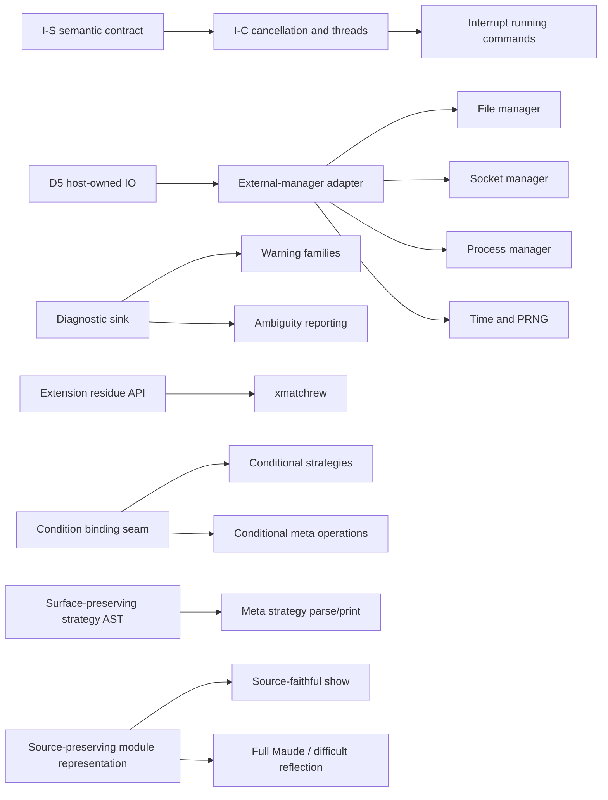

# Documentation and implementation status survey

**Survey date:** 2026-07-26
**Scope:** current documentation, public/user-facing behavior, implementation-admitted limitations, and the shape of the post-v0 documentation set.
**Non-goal:** this document does not rewrite, move, or delete any existing documentation. It is the requested survey artifact and a migration recommendation.

## 1. Executive findings

1. **The implementation is substantially ahead of its planning documents.** The current checkout passes the 78/78 audit corpus, the 87/87 legacy sweep, and 446 release tests. Every U/V/N/T/M subsystem fixture passes. The I-S meta-interpreter fixtures remain semantically conformant, but two large Russian-dolls fixtures are now at or beyond the retained 60-second gate: the all-subsystem run was 110/112, I19 passed alone in 59.77 seconds, and I20 passed only after raising the timeout to 180 seconds (82.01 seconds). The documentation's unconditional “27/27 gate green” statement is therefore not true under the recorded 60-second gate on this checkout/machine.
2. **There is no reliable single source of current truth.** `docs/migration/README.md` and `01-architecture-map.md` point to `fable-audit.md` as the complete current ledger, but that file now mixes four things: a valuable historical differential audit, resolved findings, still-live limitations, and descriptions made false by later implementation. Its status heading was refreshed without refreshing several substantive sections.
3. **The raw material for an actually-working feature list exists, but is scattered.** The best starting points are `fable-audit.md` §1, the command enum and `Session` dispatch, the completion headers in `remaining-plans/`, the subsystem fixtures, and crate-level code. None is sufficient alone. The feature inventory in `01-architecture-map.md` is explicitly a Maude parity-target list, not a tnk support matrix.
4. **Future work is interleaved with history.** `roadmap.md`, `subsystems-goal.md`, `objects-io-plan.md`, the six `remaining-plans`, and source comments all contain future-looking statements. Many are completed or stale; others are real but differ in confidence. They should not be retained as one linear roadmap. They should be extracted into independent issue/proposal records with explicit dependency edges and acceptance evidence.
5. **User documentation is the largest documentation gap.** There is no root `README.md`, installation/build guide, CLI quickstart, command reference, embedding guide for `tnk-session::Session`, current limitations page, or concise explanation of the default solver-free build versus `smt-z3`.
6. **Staleness is not confined to Markdown.** Several crate module comments, test comments, and conformance fixture comments still describe implemented functionality as deferred or inert. Treating “the code comments” as the detailed behavior manual, as the migration README currently recommends, is unsafe.
7. **Release metadata still describes a private pre-release workspace.** The workspace version is `0.0.0`, `publish = false`, and no root license or release-facing README is present. That may be intentional for a binary prototype, but it needs an explicit v0 distribution decision rather than an accidental carry-over.

## 2. Evidence and confidence

### 2.1 Checks run during this survey

| Check | Observed result | What it establishes |
|---|---:|---|
| `cargo test --release --workspace --features smt-z3` | **446 passed**, 12 suites; warnings only | Current Rust tests pass in the optional-solver configuration after the TNK-004 repair. |
| `tools/audit-scoreboard.sh` | **78/78 PASS** | Every retained post-audit correctness fixture, including TNK-004's open conditional, matches the Maude 3.5.1 oracle under the harness contract. |
| `tools/legacy-sweep.sh` | **87/87 CLEAN** | Legacy fixtures either match exactly or reproduce their recorded accepted diff. |
| `tools/subsystems-scoreboard.sh` with the current `smt-z3` release binary | **110/112 PASS** at the default 60-second timeout | U/V/N/T/M all pass; I19 and I20 hit the timeout in the combined run. |
| Isolated I19 | **PASS**, 59.77 s | Semantics match; this fixture is on the gate boundary and is timing-sensitive. |
| Isolated I20, default timeout | **timeout**, 60.32 s | The recorded I-S 60-second gate is currently red. |
| Isolated I20, `TIMEOUT_SECS=180` | **PASS**, 82.01 s | The failure is a performance/gate failure, not an observed output divergence. |
| `TIMEOUT_SECS=180 tools/subsystems-scoreboard.sh` with the current `smt-z3` release binary | **112/112 PASS** | Every retained subsystem fixture remains conformant under the extended gate used for the known I19/I20 performance residual. |
| `B1b-collapse-counts.maude` direct oracle diff | **PASS** | The audit's still-unresolved-looking collapse-count bullet and related fixture comments are stale. |
| Incomparable-membership probe | Oracle chooses sort `D`; tnk chooses `B` | The component-index tiebreak remains a real wrong-sort result on contradictory membership specifications. |
| Strategy-module reflection probe | `upModule`, `upStratDecls`, and `upSds` compute; one diff: reflected implicit BOOL import is `protecting` instead of the oracle's `including` | The old “strategy reflection is inert” claim is stale, but the newly observed import-mode divergence needs its own issue/fixture. |
| General evaluation-strategy probe | Oracle and tnk match on retained interleaved/multiple-top, `owise`, shared-redex, and AC/AU semi-eager cases | TNK-001 is resolved; `conformance/strat.maude` preserves value, sort, and rewrite-count coverage. |
| Strategy import/modifier probes | Imported `sd` executes in Maude but tnk rejects it; Maude ignores `top(idle)` with a warning while tnk errors | Strategy flattening and generalized `top` behavior are incomplete. |
| Stuck conditional-branch probe | Maude and tnk both normalize the branches to `false` and `true`, perform 5 rewrites, and report result sort `Bool` | TNK-004 is resolved; decided conditions remain lazy and user equations are tried only after stuck branches normalize. |
| Declaration-recovery probes | Maude warns and recovers from out-of-range `frozen` and nonbinary `assoc`; tnk now matches both semantic recovery paths, with warning text still normalized away | TNK-002 and TNK-003 are resolved with retained oracle-differential fixtures. |
| Extreme-subnormal `decFloat(_, 0)` probe | Oracle returns a 783-byte exact `DecFloat`; tnk leaves the application unreduced | The bounded numeric residual is confirmed directly. |
| Candidate-control probes | Basic cross-kind overloading, CUI collapse matching, and iter-membership matching compute correctly | Several broad source “follow-up” comments are stale; only narrower untested corners should remain candidates. |
| Local Markdown link scan | No missing file targets | Navigation is conceptually confusing but not presently broken at the file-link level. |

The differential harness deliberately ignores warning/advisory blocks. “Byte-conformant” below therefore means byte-conformant under that documented normalization contract, not diagnostic-text parity.

### 2.2 Confidence labels used below

- **Verified:** exercised by a current gate or direct probe in this survey.
- **Implemented/covered:** directly present in dispatch plus retained focused fixtures/tests, but not independently re-probed item by item here.
- **Source-admitted limitation:** the implementation rejects, leaves inert, or calls out the boundary. It should receive a minimal oracle reproduction before becoming a permanent public issue.
- **Historical claim:** useful provenance, not current evidence.

## 3. Seed inventory of actually-working behavior

This is the recommended seed for the eventual live feature catalog. It is deliberately organized by user-visible capability rather than by migration phase. A final feature catalog should attach a fixture/test reference to every row and keep limitations adjacent to the supported surface.

### 3.1 Running and embedding

| Surface | Actually working now | Boundary to state in user docs | Primary evidence/source |
|---|---|---|---|
| CLI | `tnk-repl [-no-prelude] [-no-banner] [file]`; optional file is evaluated before the interactive loop; terminal prompts/history and multiline buffering; plain output when redirected | Only the first non-flag path is loaded; extra arguments are ignored with a message. `-batch`, random-seed, directory, and broader Maude CLI flags are absent. | `crates/tnk-repl/src/main.rs` |
| Standing prelude | Finds `prelude.maude` through colon-separated `$MAUDE_LIB`, then the current directory; `-no-prelude` disables it | The default binary needs a discoverable prelude. This is REPL policy, not automatic behavior of the lower crates. | `main.rs`; audit C6c |
| File loading | Initial file argument, `load`, and idempotent `sload`; relative lookup through CWD and `$MAUDE_LIB`, with optional `.maude` suffix | No general `pwd`/`cd`/`ls`/`popd` family. | `tnk-session::Session::meta_load`; audit C6b |
| Reusable session | `tnk_session::Session` owns interner, modules, views, current module, continuations, reflection caches, standard input, and isolated local interpreter children; `eval`, `input_complete`, `current`, and `set_stdin` are the main host seam | Session is synchronous and thread-confined. Cancellation/thread-backed process coordination is not implemented. | `crates/tnk-session/src/lib.rs`; I-S fixtures |
| Terminal adapter | `tnk_repl::Repl` wraps `Session` with color and line wrapping | Terminal concerns should not be documented as part of the semantic API. | `crates/tnk-repl/src/lib.rs` |

### 3.2 Language and module surface

- **Module forms:** `fmod`, `mod`, `fth`, `th`, `smod`, `sth`, `omod`, and `oth` parse and build on their implemented paths. Functional/system rule gating, theory nonexecution, strategy declarations, and object desugaring are represented separately.
- **Declarations:** sorts, subsort chains, operator overloads, variables, memberships (`mb`/`cmb`), equations (`eq`/`ceq`), rules (`rl`/`crl`), strategies (`strat`, `sd`, parsed `csd`), classes/subclasses/messages, and views.
- **Statement conditions/attributes:** equality, matching assignment (`:=`), sort tests, and rewrite conditions (`=>`) are implemented for equations/rules on covered paths; `owise`, labels, `nonexec`, and variant/narrowing markers are retained or acted on. Statement `print` content is captured for validation. `metadata` and other accepted statement attributes are not generally retained or executed and must not be advertised as working behavior.
- **Operator theory/behavior attributes:** associative, commutative, identity (two-sided and one-sided), idempotent, iteration, constructors, evaluation strategy, frozen positions, precedence/gather/format, polymorphism, special hooks, and object/configuration/message/portal roles are implemented on covered paths. `memo` is parsed but ignored.
- **Module algebra:** protecting/extending/including/generated-by import syntax and flattening, sums, renaming, theories and views, formal parameters, default and explicit views, nested/chained instantiation, parameterized views, structured sorts, and the covered free/bound parameter cases. Import modes do not currently enforce their distinct no-junk/no-confusion obligations; `generated-by` is accepted through the protecting-style flattening path.
- **Frontend:** hand-written lexer and surface parser, per-module mixfix grammar, Earley term parser, precedence/gather handling, prefix forms on covered operators, `(term).Sort` disambiguation, bracketed comments, statement recovery, command ambiguity selection, and Maude-style pretty printing/line wrapping.
- **Terms and values:** open command terms, declared and on-the-fly sorted/kind variables, quoted identifiers, strings, arbitrary-size naturals/integers/rationals, floats, iteration notation, and structured sort names on covered paths.

Important qualification: “module algebra works” does not mean every Maude validation obligation is implemented. View sort/op/axiom validation and several unusual module-expression/map forms remain source-admitted boundaries. Likewise, broad README language such as “every well-formed module” is not justified while other legal overload and validation forms still hit explicit unsupported paths.

### 3.3 Equational kernel and predefined data

- Index-based hash-consed DAG arena, mark/sweep GC, explicit roots, construction sharing, and normal-form forwarding.
- Order-sorted signatures: subsort closure, connected-component kinds/error sorts, least-sort computation, memberships, overload resolution, and constructor analysis.
- Reduction and matching modulo free, associative, associative-commutative, identity, commutative/idempotent, and iteration theories on the covered common paths; cross-theory alien matching; nonlinear and extension matching cases covered by the audit/legacy corpora.
- Unconditional/conditional equations and memberships, `owise`, matching backtracking across condition fragments, strategy-controlled evaluation, and built-in-before-user-equation dispatch.
- Real Maude prelude and major predefined families: BOOL, NAT, INT, RAT, FLOAT, STRING, QID, conversion, random, counter, bound, LEXICAL token hooks, and parameterized LIST/SET/MAP/ARRAY families on retained fixtures.
- Built-in structural equality/decomposition, numeric/string/float operations, conversions, and exact arbitrary-precision integer/rational leaves on their registered `special` hooks.

The final manual should name supported prelude modules from a generated/load-tested manifest rather than repeat the current prose claim “all data types work.” Unknown `id-hook` classes intentionally load as inert operators, so hook coverage is a more precise boundary than module-load success.

### 3.4 Top-level commands that execute

The surface parser and `Session` dispatch currently implement:

- `reduce` / `red`
- `match` / `xmatch`
- `rewrite` / `rew` with bounds
- `frewrite` / `frew` with bound and gas
- `erewrite` / `erew` with bound and gas
- reachability `search` with solution/depth bounds, `=>1`, `=>+`, `=>*`, `=>!`, and `such that`
- `continue` for rewrite, frewrite, ordinary/SMT search, variant enumeration/unification/matching, and narrowing continuations supported by the saved continuation type
- `srewrite` / `dsrewrite`
- `check` and `smt-search`
- `unify` and `irredundant unify`
- `get variants` and irredundant variants, including irreducibility blockers
- variant unification, filtered variant unification, and variant matching
- `vu-narrow` / `fvu-narrow`, fold/vfold, filtering/delay/path modes, bounds, and goals/conditions
- per-command `in MODULE :` qualification where represented by the command enum

Session-level commands currently include `select`, `load`, `sload`, `show modules`, `show module`, `show views`, `show view`, regular/narrowing path displays, narrowing frontier/most-general-state displays, `show search graph`, trace flags, implicit BOOL toggling, timing/breakdown toggles, verbose mode, and `quit`/`q`/`exit`.

The supported `show module` is a reconstructed flattened summary, not a source-faithful module printer. Unrecognized `set` directives are generally silent no-ops for compatibility with loaded files; acceptance must not be documented as implementation.

### 3.5 Dynamic rewriting, strategies, and objects

- Rule rewriting, conditional rules, frozen positions, per-symbol rule fairness, resumable rewrite/frewrite, position-fair frewrite, graph-based search, state deduplication, paths, and graph rendering.
- Trace recording/rendering for reduction and ordinary rewriting, with master/body/substitution/rewrite/whole/condition/builtin/equation/membership/rule flags.
- Strategy execution for the covered `idle`, `fail`, `all`, labeled application, top-level rule application, `one`, sequencing, union, iteration/normalization, branches and derived sugar, match/amatch/xmatch tests, matchrew/amatchrew, named `sd` calls, and parameter substitution.
- Object-module desugaring; class/message/configuration roles; object-message `erewrite`; fast object/message delivery and generic multi-object `leftOver` rules; standard-stream scripted input/output.

Explicit strategy boundaries: `xmatchrew` and conditional `csd` reject at resolution; some generalized `top(...)`, generalized operator evaluation `strat`, imported strategy definitions, and recursive parameterized strategy calls have source-admitted restrictions. Matchrew/amatchrew scheduling has a recorded cumulative-count divergence.

### 3.6 Reflection, symbolic reasoning, and verification

- META-LEVEL down/up translation for modules, views, terms, imports/declarations/statements, sort/kind queries, parsing, ordinary pretty printing, well-formedness checks, reduce/normalize/rewrite/frewrite/apply/xapply/match/xmatch/search/search-path, and the implemented symbolic operations.
- `upModule`, including covered parameterized and strategy-module forms; `upStratDecls` and `upSds` now compute. A direct strategy-module probe found one remaining difference: tnk reflects its implicit BOOL import as `protecting`, while the oracle emits `including`.
- Order-sorted unification modulo free/S/CUI/AC/ACU/A/AU, irredundant and disjoint modes, current/legacy meta forms, incompleteness propagation, exact retained gate output.
- Folding variants, variant subsumption, variant unification/matching, filters/blockers, current/legacy meta forms, and resumable enumeration.
- Variant-based narrowing, rooted state graph, fold/vfold, delayed filtering, paths/frontiers/most-general states, current in-scope meta narrowing operations, and persistent caches.
- Typed SMT language, `check`, root-only constraint-bearing `smt-search`, `metaCheck`, and cached `metaSmtSearch` in the optional `smt-z3` lane. The default build is solver-free and deliberately returns null/undecided behavior.
- Native constructor variant satisfiability/validity and the compatible `VAR-SAT-TOOL` facade without z3.
- LTL model checking, counterexample lassos, SAT/tautology, and BDD-backed prime implicants under the M fixtures.
- Local synchronous meta-interpreter object protocol: child creation/deletion, module/view insertion, reduction/rewriting/search/strategy/symbolic requests, continuations, lifecycle errors, isolation, and pass-boundary accounting.

Explicit reflection boundaries include `metaParseStrategy`/`metaPrettyPrintStrategy`, conditional/partial meta matching/application corners, partial AC `metaXmatch` context, some flat builtin-closure reflection, structured module-expression/op-to-term view maps, and remote/thread-backed interpreter creation.

## 4. Documentation inventory and staleness

| Artifact | Current value | Staleness/problem | Recommended disposition |
|---|---|---|---|
| `fable-audit.md` | Best historical differential investigation; excellent minimal repros, severity taxonomy, and non-obvious constraints | No longer a complete current ledger. Resolved and live items are interleaved; §§4–5 describe already-landed work as future; some §2/§3 bullets are now false | Preserve as a dated audit record. Extract every still-live item into issue records; stop naming it current ground truth. Add a prominent historical/status boundary when docs are rewritten. |
| `docs/migration/README.md` | Useful orientation, crate layering, and conformance method | No root-facing usage; “every well-formed module” is too broad; “Phase 2 in progress” conflicts with the mainline-complete framing; feature counts and I-S gate are embedded prose; it points to stale sources as authoritative | Replace its live-status role with a root README plus `docs/features.md`, `docs/limitations.md`, and a conformance page. Keep migration narrative as history. |
| `01-architecture-map.md` | Strong Maude architecture map and parity target | Its feature list mixes Maude targets with tnk status; coarse “DONE” labels hide partial command/meta/IO surfaces; old implementation verdicts (for example a `mio` reactor) conflict with later host-owned decisions | Keep as reference architecture, remove current-status authority, and link each target family to the live feature/issue index. |
| `03-open-decisions.md` | Durable rationale for arena/GC/dispatch/backends/session boundaries | Title/status language still treats implemented choices as forward decisions; some proposed crate/binary names do not match the workspace; resolved decisions and genuinely open decisions are mixed | Retain as an ADR index, give each decision a status and actual implementation pointer, and move open choices into issue proposals. |
| `roadmap.md` | Contains many useful acceptance notes, dependencies, and residual descriptions | Mostly a historical execution plan. A–D and most of G landed; E/F are partial/open; priority and risk sections mix resolved and live entries | Dissolve rather than refresh as another linear roadmap. Archive completed phases; extract live leaves into issue files and dependencies into an issue index. |
| `correctness-goal.md` | Frozen correctness-goal contract and original gate semantics | Reads as an active goal driver; counts/status predate later subsystem work; accepted-divergence references are split from their current ledger | Archive as a completed contract. Create a current conformance guide generated from harness manifests and `accepted-diffs/`. |
| `subsystems-goal.md` | Valuable S/T/M/I contracts, manifests, invariants, and phase boundaries | Umbrella goal is complete through I-S, yet still carries serial-cursor planning language. I-C is future work; recorded 27/27 I-S status currently misses the 60-second performance gate | Archive completed subsystem contract; extract I-C and the I19/I20 performance gate as separate issues. Keep fixture manifests machine-derived where possible. |
| `ac-matcher-plan.md` | Detailed source-derived algorithm/verification record | Still framed as an implementation plan and contains pre-port “current matcher” claims | Reclassify as a completed implementation record/reference. Move only real residuals (ordering/performance/representation) to issues. |
| `objects-io-plan.md` | Useful Maude object/IO source map and D5 rationale | Mixes completed object/STD-STREAM/host suspension work with a shelved in-engine reactor plan. Several “remaining object scheduler” statements are false: the generic `leftOver` path is implemented and tested | Split historical object implementation record from future host manager proposals. Do not revive the shelved reactor as the default design. |
| `remaining-plans/01`–`05` | High-quality completion records for AU, variants, narrowing, SMT, and model checking | Directory name says “remaining”; long bodies intentionally preserve present-tense preimplementation claims | Move to an implementation-history/archive namespace. Keep their top completion headers and source citations. |
| `remaining-plans/06-sessions-meta-interpreters.md` | Binding I-S/I-C boundary and detailed local protocol contract | One file mixes complete I-S and unstarted I-C; historical “next”/cursor wording is easy to misread | Archive I-S record; extract I-C into one or more self-contained proposals with the I-S semantic contract as a dependency. |
| `reports/A1`–`A8` | Valuable C++/manual deep dives | They describe Maude scope and proposed Rust layouts, not necessarily the code that landed; filenames/types and “follow-up” statements are often historical | Keep in a clearly labeled reference archive. Never cite these alone for live support. |
| `reports/S0-bdd-spike.md`, `T0-smt-spike.md`, `spikes/smt-spike/README.md` | Decision evidence and reproducible experiments | Spike status is not product status; standalone spike code is outside the workspace | Keep as decision evidence, linked from ADRs, not from the user feature list. |
| `conformance/accepted-diffs/README.md` and four diff files | Current, concrete ledger of ratified legacy divergences | Separate from other known limitations; readers can mistake “legacy clean” for exact parity | Keep live under a conformance section. Link each diff to a limitation/issue and state the normalization contract. |
| `CLAUDE.md` | Repository operator guidance | Not user or architecture documentation; explicitly owner-maintained | Leave untouched and exclude from the public docs index. |
| Rustdoc/module comments and fixture comments | Often the most precise implementation notes | Numerous stale phase claims; examples below | Correct alongside the later docs consolidation, after a repro confirms each boundary. Do not treat comments as authoritative merely because they are near code. |

### 4.1 Concrete stale or contradictory claims

These are not stylistic complaints; they can cause an incorrect user manual or backlog.

- `fable-audit.md` §2 says there are no file commands or CLI flags and that implicit BOOL/verbose controls are inert. `load`, `sload`, initial file loading, `-no-prelude`, `-no-banner`, `set include BOOL`, and `set verbose` are implemented.
- The same section says on-the-fly kind variables are absent. Current command parsing accepts them; a direct multi-top kind probe parsed and reduced `Z:[X]`.
- Its collapse-under-identity count residual is now false: the retained B1b fixture matches 1/2 and 2/4/6 rewrite targets exactly.
- Its multi-top kind-label residual is half stale: tnk now reproduces the oracle's DFS-derived `[B,D,A]`. The code still uses a different tie-break for incomparable membership targets, so that should become a separate issue rather than leaving the combined bullet unchanged.
- Its `upModule`-of-strategy-module and ordinary `metaPrettyPrint` statements predate newer reflection work. The retained `prelude-meta.maude` fixture proves ordinary pretty printing and the strat-free `upStratDecls`/`upSds` case. A direct strategy-module probe shows `upModule`, real strategy declarations, and `sd` definitions now compute, with one newly observed difference: implicit BOOL is reflected as `protecting` rather than the oracle's `including`.
- `fable-audit.md` §4 still says there is no standing prelude, implicit import, or file command. All three landed. §5 recommends multiple already-completed audit phases.
- `docs/migration/README.md`, `01-architecture-map.md`, `subsystems-goal.md`, and the I-S plan state 27/27 I fixtures as a currently green retained gate. Current semantic output still matches with more time, but the specified 60-second gate does not.
- `tnk-core/src/symbol.rs` says only a subset of theory variants is implemented and refers to a future `Na` variant that is not in the current enum. The actual enum and runtime have moved on.
- `tnk-modules/src/meta.rs` says SMT search, `upStratDecls`, and `upSds` are deferred, while dispatch implements them and retained fixtures exercise them. It also calls the conditional-strategy surface complete although `csd` rejects in `tnk-frontend/src/strategy.rs`.
- `tnk-repl` tests and `conformance/prelude-meta.maude` still label now-computing strategy reflection results as deliberately inert.
- `tnk-frontend/src/load.rs` and `conformance/correctness-membership-theory.maude` retain follow-up comments for behavior now covered by the collapse fix.
- `objects-io-plan.md` still contains preimplementation scheduler gaps although `Engine::advance_erewrite_pass` implements both object-message and generic `LeftOver` rule classes.

## 5. Future-work classification

The cleanup should distinguish **confirmed product gaps**, **known accepted divergences**, **source-admitted candidates needing a repro**, and **optional architecture/performance proposals**. Mixing these classes is a major reason the current roadmap became hard to read.

### 5.1 Confirmed gaps or current deviations

These have current implementation evidence, a retained audit record, or a direct failed gate.

#### Sessions, processes, and external interaction

- **Phase I-C:** cooperative cancellation, thread-confined worker coordination, and thread-backed/remote `newProcess`; preserve I-S semantics and owned data boundaries.
- **Running-command interruption:** Ctrl-C currently abandons only the current input buffer, not an executing reduction/search. This naturally depends on the cancellation part of I-C.
- **External managers beyond STD-STREAM:** file, socket, OS process, time, and PRNG services. The binding D5 direction is host-owned adapters, not an in-kernel reactor.
- **LOOP-MODE:** parser/builtin/interactive loop protocol remains absent.

#### Language, strategies, reflection

- `memo` semantics and memo-table controls.
- Trace emission from ordinary search and nested rewrite-condition searches.
- `xmatchrew`: requires exposing the extension residue and reassembling the rewritten portion.
- Conditional `csd`: requires runtime condition bindings to enter the strategy body.
- `metaParseStrategy` and `metaPrettyPrintStrategy`: require faithful strategy meta-construction and a surface-preserving strategy representation.
- Strategy declarations/definitions are not imported into a strategy module's flatten: an imported `sd` that executes in Maude is rejected as unknown by tnk.
- `top(...)` over a non-application strategy differs: Maude warns, ignores the modifier, and executes the inner strategy; tnk rejects it.
- Full Maude and LaTeX output remain deliberately deferred product surfaces.

#### REPL and diagnostics

- Warning/advisory infrastructure and the concrete warning families: preregularity, collapse, ambiguity, bad declarations, import hygiene, and discarded modules.
- The confirmed process-killing declaration paths for out-of-range `frozen` and nonbinary `assoc` are resolved with atomic Maude-compatible recovery. Sibling theory-attribute arity/kind cases remain unverified risk candidates, while warning text remains part of the deferred diagnostics surface.
- Remaining command families: `parse`; filesystem/navigation commands; debugger/breakpoint/trace-select controls; profiling; complete memo controls; broader `show` introspection; source-faithful `show module`; the `set print` family; remaining CLI flags.
- Real timing/rate reporting: `rewrites/second` is currently a fixed `0ms`/unknown-rate tail.

#### Current behavioral/cosmetic residuals

- Matchrew/amatchrew parallel-odometer accounting; indexed metaSearch billing. These are ratified accepted diffs, not hidden failures.
- AC match-solution enumeration order and mixed-symbol ACU search-goal print order. These are also recorded accepted diffs.
- Mixed-symbol ACU print/canonicalization order, bounded AC `frewrite` intermediate order, strategy-echo parentheses, and several trace/result annotation/wording differences cataloged in the audit.
- `decFloat(f, 0)` on extreme subnormal values: exact decomposition still attempts to convert the power-of-two denominator to `u64`.
- Garbage-term Earley explosion on a large grammar; current protection removes a common trigger but not the underlying case.
- Incomparable membership-target tie-breaking; the kind-label component-index repair should not be conflated with this remaining semantic corner.
- Strategy-module `upModule` reflects the automatic BOOL import with the wrong mode (`protecting` versus oracle `including`); add the survey probe as a retained fixture before treating strategy reflection as closed.
- I19/I20 performance relative to the retained 60-second I-S gate.

### 5.2 Source-admitted candidates that need a minimal oracle fixture

Do not copy these comments directly into a public limitations page. First determine whether the comment is stale, whether Maude accepts the form, and whether the behavior matters to the supported v0 contract.

- Recursive parameterized strategy calls remain a source-admitted candidate; the generalized evaluation, `top`, and imported-strategy cases have now been promoted to confirmed deviations above.
- Unusual cross-kind overload grouping remains a candidate, but the direct basic case with two domain/range kinds conforms and does not reach the old assertion.
- Exotic AC/iter membership-extension corners remain candidates. Direct CUI collapse matching and iter-membership probes produced the oracle's solution set/results, so the broad source comments are stale. The incomparable-membership tiebreak and stuck-branch behavior are separately confirmed above.
- View kind/subsort preservation, op-map type checking, theory proof obligations, disambiguated source op maps, renamed/instantiated theory imports, and instantiation whose base is a module sum.
- Conditional `metaMatch`, conditional/partial `metaApply`, partial AC `metaXmatch` contexts, flat builtin-closure up-translation, non-mixfix print options, and structured module-expression/op-to-term view reflection.
- Re-entrant rewrite-condition GC rooting when the low-level engine is embedded with GC enabled; the REPL currently runs with GC disabled in the cited path.
- Grammar sort-structure bias and unusual prefix/assoc forms mentioned as frontend follow-ups.
- Unknown prelude `id-hook` families that currently load as inert operators; classify each by whether it belongs to LOOP-MODE, Full Maude, an optional extension, or v0 parity.

### 5.3 Optional architecture/performance proposals

These should be labeled proposals, not bugs, unless a benchmark or accepted input establishes a user-visible failure.

- Precompiled sort decision diagrams/sort paths instead of direct least-sort computation.
- Red-black/persistent AC matching structures and further matcher allocation/performance work.
- A compiled/source-preserving module representation beyond the landed home-grammar point fix. It could improve faithful source `show`, Full Maude, and difficult reflection/import cases, but it is a design decision rather than an automatic prerequisite for all v0 work.
- Broader conformance CI and generated manifests. The harness exists; repository CI configuration does not.

### 5.4 Intentional post-parity language-policy changes

Do not mix these with parity bugs while the initial implementation is still converging on Maude. Preserve the reference behavior through the bug-free parity milestone, then select and specify each divergence explicitly.

- **Strict declaration references:** invalid user references in declarations—starting with out-of-range `frozen (...)` argument positions—should eventually be loud module errors, not Maude-style warnings followed by attribute removal and continued execution. The compatibility layer now implements Maude's atomic warning-and-ignore semantics; strict rejection remains a later language-policy change with its own diagnostics and module-transaction contract.
- **Strict theory attributes:** semantically invalid operator-theory attributes—starting with `assoc` on a declaration whose arity is not two—should eventually be loud module errors, not Maude-style warnings followed by clearing the invalid effective attribute and compiling the operator under a weaker theory. The v0 compatibility layer now preserves Maude's recovery semantics; strict rejection remains a later language-policy change and must cover the full `assoc`/`comm`/`id`/`idem`/`iter` validation family coherently.

## 6. Recommended issue/proposal collection

Use one self-contained file per issue under a neutral namespace such as `docs/issues/`, plus an index that records **dependencies only**, not a total priority order. Suggested records from this survey:

| Proposed record | Class | Depends on / relation |
|---|---|---|
| `SES-cancellation-and-thread-coordination` | confirmed feature gap | I-S is the frozen semantic contract |
| `REPL-interrupt-running-command` | confirmed UX gap | depends on cancellation support |
| `IO-host-manager-adapter` | design/interface proposal | follows D5; prerequisite for concrete non-stream managers |
| `IO-file`, `IO-socket`, `IO-process`, `IO-time-prng` | independent feature proposals | each depends on the adapter contract; do not require each other |
| `LANG-loop-mode` | feature proposal | related to terminal/session protocol; not the same as external IO |
| `DIAG-diagnostic-sink` | cross-cutting feature | enables individual warning/advisory families and ambiguity reporting |
| `REPL-source-introspection`, `REPL-print-controls`, `REPL-debugger`, `REPL-profile-timing`, `REPL-filesystem`, `REPL-cli-flags` | independent command families | diagnostics is useful but not a universal prerequisite |
| `STRAT-xmatchrew` | confirmed feature gap | needs extension-residue/reassembly API |
| `STRAT-conditional-definitions` | confirmed feature gap | needs condition bindings in strategy resolution/execution |
| `STRAT-parallel-odometer` | accepted divergence / behavioral issue | also owns `strategy.diff`; related to indexed metaSearch accounting |
| `STRAT-general-forms` | candidate family | split after oracle repros for eval-strat, generalized top, recursion, imports |
| `META-strategy-parse-print` | confirmed feature gap | needs sort-aware meta constructors and surface-preserving strategy AST |
| `META-conditional-and-partial-compute` | candidate family | reuse the engine condition-enumeration seam; split by observable contract |
| `META-flat-and-structured-reflection` | candidate/design family | related to, but not automatically blocked by, module representation work |
| `MOD-view-validation-and-map-forms` | source-admitted correctness family | independent checks can be split; theory obligations may need diagnostics |
| `MOD-source-preserving-module-algebra` | architecture proposal | would enable source-faithful show and simplify some Full Maude/meta work |
| `CORE-memo` | confirmed feature gap | memo controls depend on the runtime table |
| `CORE-membership-residuals` | correctness candidates | use component index for incomparable tie-break; separate iter/extension repros |
| `PARSE-garbage-complexity-cap` | robustness issue | ambiguity warnings relate to diagnostics; the cap itself is independent |
| `PRINT-canonicalization-and-echo` | accepted/cosmetic family | mixed ACU order drives bounded-frewrite and some echo differences |
| `NUM-decfloat-subnormal-exact` | bounded correctness issue | independent |
| `PERF-local-interpreter-gate` | current performance regression | acceptance is I19/I20 under the retained 60-second gate |
| `PERF-sort-diagrams` | optional optimization | require benchmark threshold before implementation |
| `LANG-full-maude`, `PRINT-latex` | deferred proposals | likely consume module/meta/printing work; no v0 ordering implied |

A minimal issue file should contain:

1. **Classification and status:** bug, unsupported Maude surface, accepted divergence, robustness, performance, or proposal.
2. **User-observable contract:** exact supported input and current output/failure.
3. **Oracle/desired behavior:** captured output or an explicit tnk-specific design decision.
4. **Minimal reproduction and gate:** fixture path, command, timeout, and normalization rules.
5. **Scope and non-goals:** prevent old broad plans from silently expanding the issue.
6. **Dependencies and blocks:** stable issue IDs; no guessed effort or calendar estimate.
7. **Implementation touchpoints:** relevant crates/symbols, not a speculative full design unless the issue is itself a design proposal.
8. **Acceptance criteria:** observable behavior, including value, sort, count, order, termination, and diagnostics where relevant.
9. **Provenance:** audit/plan/report links and the date they were reverified.

### 6.1 Partial-order sketch

Everything without an edge is intentionally unordered at this stage.

## 7. Recommended public documentation set

### 7.1 Live, release-facing documents

1. **Root `README.md`:** project identity, prototype/v0 status, supported platforms, build, 60-second quick example, default-prelude behavior, optional z3 build, and links.
2. **`docs/features.md`:** the authoritative actually-working matrix seeded from §3. Every row should carry a gate/test reference and a last-verified release identifier.
3. **`docs/quickstart.md`:** install/build, `MAUDE_LIB`, first module, loading a file, reduction/rewrite/search, continuation, strategies, symbolic commands, SMT lane.
4. **`docs/repl.md`:** exact CLI flags, command grammar, supported `show`/`set` subset, multiline behavior, output/timing conventions, exit/interrupt behavior.
5. **`docs/embedding.md`:** `Session` versus `Repl`, persistence, `Eval`, `input_complete`, standard input injection, local child interpreters, synchronization/cancellation boundary, and a small host example.
6. **`docs/limitations.md`:** generated from open confirmed issues and accepted diffs; distinguish deliberate exclusions, unsupported inputs, semantic divergences, cosmetic differences, and performance limits.
7. **`docs/conformance.md`:** oracle version, normalization, audit/legacy/subsystem manifests, optional solver lane, accepted-diff policy, timeout contract, and exact reproduction commands.
8. **`docs/issues/`:** proposed partially ordered issue/proposal collection, not user-manual prose.

A separate full command reference can follow from parser/dispatch extraction. It should be generated or checked against `Command`, `meta_show`, `meta_set`, and the parser so it cannot silently list accepted-but-inert commands as working.

### 7.2 Historical/reference documents

Move or label, without rewriting their historical content:

- migration architecture and C++ deep dives;
- completed goal contracts and implementation records;
- spike reports;
- dated audit;
- superseded linear roadmap.

Historical documents should open with a uniform banner: status, date range, whether present-tense claims are historical, replacement live document, and whether any open items were extracted.

## 8. Consolidation sequence

1. **Freeze the live facts.** Resolve the I19/I20 timeout contract, rerun all gates, and create the feature matrix from command dispatch plus passing fixtures. Do not start by rewriting prose from memory.
2. **Extract live issues.** Walk the audit, roadmap, goals, plans, accepted diffs, and source-admitted list. For each candidate, reproduce it or mark it “needs reproduction”; create one issue record; preserve provenance.
3. **Write release-facing usage docs.** Root README, quickstart, REPL, embedding, limitations, and conformance guide should refer only to the live feature/issue indexes.
4. **Reclassify history.** Move or banner the old audit/plans/reports after every live fact has a replacement. Completed records remain valuable; they simply stop being navigation roots.
5. **Remove duplicate status prose.** Crate/module docs should describe local invariants and APIs. Global feature status/counts belong only in the live feature/conformance indexes.
6. **Repair stale code and fixture comments.** Do this from the verified issue/feature records, not as an independent prose sweep.
7. **Add freshness checks where cheap.** Generate fixture counts and command names, link-check docs, and make the conformance page consume harness manifests. Avoid hand-copying counts into five documents.

## 9. Immediate decisions needed before the documentation rewrite

These are documentation/product-boundary decisions, not implementation priority requests:

- Is v0 a binary/source prototype only, or should any crate be publishable? This determines version/license/package metadata work.
- Is Maude diagnostic text in the v0 compatibility contract, or explicitly excluded as it is in the current harness?
- Does “supported” require the retained timeout gate, or only eventual semantic equality? The current I20 result makes this distinction concrete.
- Should ratified accepted divergences remain indefinitely supported behavior, or stay open issues with no assigned priority?
- Is Full Maude part of the eventual product direction or merely preserved reference material? The current docs say both “deferred parity target” and “kept metaprogram.”

None of these decisions blocks extracting factual feature and issue records. They only determine how the resulting release docs label them.
